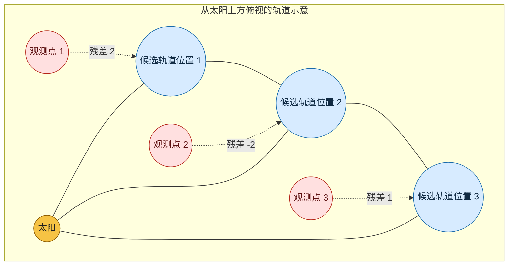

# Mean Squared Error (MSE): 从天文观测到机器学习回归

MSE（Mean Squared Error，均方误差）不是凭空设计出来的一条公式。它最初要解决的问题很朴素：**同一个真实量被多次测量时，读数彼此不一致，应该相信哪一个规律或预测？**

今天，机器学习把同一个问题换了一层外衣：模型对房价、气温或送达时间作出许多预测后，怎样判断模型整体是否可靠，并指导它变得更准？MSE 就是常用答案之一。

本文按下面的顺序说明：

1. MSE 最初要解决什么问题
2. 公式中的每一步分别在做什么
3. MSE 如何从最小二乘法发展而来
4. MSE 在现代机器学习中怎样发挥作用
5. 为什么二分类的 Logistic Regression 通常使用交叉熵而不是 MSE

---

## 1. 从一个真实问题开始：根据零散观测推算彗星轨道

设想你是 1805 年的一位天文学家。你不是站在太空中俯视彗星，而是每天夜晚从地球上用望远镜测量它相对星空的位置。连续三晚，你记录到三个位置；但是，每次读数都会有一点偏差：望远镜刻度有限、空气扰动会让星点闪烁，人工读数也会有误差。

你真正想知道的不是“第三晚彗星在哪里”，而是：**哪一条轨道最可能是彗星真实走过的路线？** 有了这条轨道，才能预报它下一次出现的位置。

下面是一个俯视示意图。黄色圆点代表太阳，蓝色实线代表某条候选椭圆轨道，红色圆点是三晚实际测到的位置。虚线长度就是模型预测位置与观测位置之间的距离，即残差。

这张图不是按比例绘制的真实天体运动图，而是将问题压缩成“在每个观测时刻，轨道预测的位置与望远镜读数相差多少”。为了方便计算，下面用一维位置表示这种差异：

| 观测夜晚 | 望远镜读数 $y$ | 候选轨道的预测 $\hat{y}$ | 残差 $e=\hat{y}-y$ |
| --- | ---: | ---: | ---: |
| 第 1 晚 | 10 | 12 | $+2$ |
| 第 2 晚 | 20 | 18 | $-2$ |
| 第 3 晚 | 30 | 31 | $+1$ |

这里 $+2$ 表示候选轨道预测得比观测位置高 2 个单位；$-2$ 表示预测得比观测位置低 2 个单位。它们都表示“相差 2”，只是偏离的方向相反。

若直接把残差相加：

$$
(+2)+(-2)+(+1)=1
$$

得到的 1 很小，却不能说明这条轨道很好：前两晚各错了 2 个单位，只是正负刚好抵消。若仅用残差和挑选轨道，一条“有时偏高、有时偏低，但每次都偏得很远”的坏轨道，可能看起来和一条真正贴近观测点的好轨道一样好。

因此，Legendre 和 Gauss 所处时代的测量问题需要一个更可靠的规则：把每次残差平方后相加，选择总和最小的候选轨道。平方会消除方向，使偏高 2 和偏低 2 都记为 4；同时也会让明显偏离观测的轨道受到更重的惩罚。这就是最小二乘法，以及后来 MSE 的具体历史背景。

---

## 2. MSE 到底在计算什么？

### 2.1 先计算每个样本的残差

对一个样本，真实值是 $y$，预测值是 $\hat{y}$。两者之差叫做**残差**或预测误差：

$$
e=\hat{y}-y
$$

这里的 $e$ 可以为正，也可以为负：

- $e>0$：预测偏高；
- $e<0$：预测偏低；
- $e=0$：预测刚好正确。

例如，真实气温为 $20^\circ\mathrm{C}$：预测 $22^\circ\mathrm{C}$ 时，$e=+2$；预测 $18^\circ\mathrm{C}$ 时，$e=-2$。两次预测都相差 $2^\circ\mathrm{C}$，只是方向不同。

### 2.2 再把残差平方：消除方向，并放大大错误

单个样本的**平方误差**为：

$$
e^2=(\hat{y}-y)^2
$$

所以前面的两种误差分别是：

$$
(+2)^2=4,\qquad(-2)^2=4
$$

这与 $(\hat{y}-y)^2$ 完全一致：$+2$ 或 $-2$ 只是括号内残差 $\hat{y}-y$ 的两个可能取值。

平方有两个实际效果：

1. **正负不会抵消**：偏高 2 与偏低 2 都会记为 4。
2. **大错受到更多惩罚**：误差从 2 增至 4 时，平方误差从 4 增至 16，不只是翻倍而是变成 4 倍。

这个特性适合“严重失准比轻微偏差更不能接受”的任务。例如，预报温度偏差 $8^\circ\mathrm{C}$ 通常应比偏差 $1^\circ\mathrm{C}$ 得到强得多的惩罚。

### 2.3 对全部样本取平均，才得到 MSE

如果有 $n$ 个样本，MSE 是所有平方误差的平均值：

$$
\mathrm{MSE}=\frac{1}{n}\sum_{i=1}^{n}(\hat{y}_i-y_i)^2
$$

请区分两个概念：

- $(\hat{y}-y)^2$：**一个样本**的平方误差；
- $\mathrm{MSE}$：**一批样本**的平均平方误差。

回到上面的三次天文观测：

$$
\mathrm{MSE}=\frac{(+2)^2+(-2)^2+(+1)^2}{3}
=\frac{4+4+1}{3}=3
$$

取平均使结果不随样本数量简单增大。这样，收集了 100 条记录的模型与收集了 1,000 条记录的模型，才可以在同一尺度上比较。

---

## 3. MSE 的来源：最小二乘法

### 3.1 历史上的“最小二乘”

法国数学家 Adrien-Marie Legendre 在 1805 年发表了最小二乘法；Carl Friedrich Gauss 随后在 1809 年系统阐述并推广了相关方法。它们服务的核心场景就是天文、测量与误差数据：从一组不完美的观测值中，选出一组最合理的参数。

以一条直线模型为例：

$$
\hat{y}=wx+b
$$

不同的 $w$ 和 $b$ 会画出不同直线。最小二乘法选择让**残差平方和**最小的那条：

$$
\mathrm{SSE}=\sum_{i=1}^{n}(\hat{y}_i-y_i)^2
$$

SSE 的全称是 Sum of Squared Errors，即平方误差和。

### 3.2 从 SSE 到 MSE：目标相同，尺度不同

MSE 只是在 SSE 前面除以样本数：

$$
\mathrm{MSE}=\frac{1}{n}\mathrm{SSE}
$$

对于固定的数据集，$n$ 是常数。因此：

$$
\arg\min \mathrm{SSE}=\arg\min \mathrm{MSE}
$$

也就是说，最小化 SSE 与最小化 MSE 会选出同一个模型。机器学习里常用 MSE，是因为它的数值更便于解释和比较：它表示“平均每条样本的平方误差”。

### 3.3 为什么最小二乘法有理论依据？

最小二乘法不只是“把误差平方看起来很方便”。在一组明确的概率假设下，它恰好等于寻找**最可能产生当前观测数据**的模型。这种做法叫最大似然估计（Maximum Likelihood Estimation, MLE）。

#### 第一步：把观测值拆成“规律 + 噪声”

设模型由参数 $\theta$ 控制。在第 $i$ 个输入 $x_i$ 上，模型给出的无噪声预测是 $f_\theta(x_i)$。真实观测值则写为：

$$
y_i=f_\theta(x_i)+\varepsilon_i
$$

其中 $\varepsilon_i$ 是测量误差。例如，彗星有一条确定的真实轨道，$f_\theta(x_i)$ 是这条轨道在第 $i$ 晚应出现的位置；$\varepsilon_i$ 则来自望远镜刻度、空气扰动和读数偏差。

要从概率角度推出最小二乘法，需要作出以下模型假设：

$$
\varepsilon_i\overset{\mathrm{iid}}{\sim}\mathcal{N}(0,\sigma^2)
$$

它包含三个意思：

- **均值为 0**：仪器不会长期、系统性地把所有位置都测高或测低；正误差与负误差在长期平均后抵消。
- **同一方差 $\sigma^2$**：每晚测量的典型不确定度相近。例如，三晚使用相同仪器且天气条件类似。
- **独立（independent）**：第一晚的读数偏高，并不会使第二晚也更容易偏高。

符号 iid 表示 independent and identically distributed，即“相互独立且服从同一分布”；$\mathcal{N}(0,\sigma^2)$ 表示均值为 0、方差为 $\sigma^2$ 的正态分布。

#### 第二步：一条观测值出现的概率为什么含有平方？

在上述假设下，给定参数 $\theta$ 和输入 $x_i$，第 $i$ 条观测 $y_i$ 的条件概率密度为：

$$
p(y_i\mid x_i,\theta)
=\frac{1}{\sqrt{2\pi\sigma^2}}
\exp\left(-\frac{\left[y_i-f_\theta(x_i)\right]^2}{2\sigma^2}\right)
$$

括号中的 $y_i-f_\theta(x_i)$ 就是残差。正态分布的钟形曲线决定了：残差越接近 0，观测值在该模型下越可能出现；残差的绝对值越大，概率密度下降越快。注意，指数中出现的正是**残差平方**。

例如，若两条候选轨道都假设 $\sigma=1$，一条在某晚的残差为 1，另一条为 3，那么它们的指数部分分别为：

$$
\exp\left(-\frac{1^2}{2}\right)
\quad\text{和}\quad
\exp\left(-\frac{3^2}{2}\right)
$$

后者远小于前者。概率模型会强烈降低“预测偏离观测很远”的轨道的可信度。

#### 第三步：多条观测值的联合似然

现在有 $n$ 条观测。由于假设它们相互独立，所有观测同时出现的概率密度等于每条观测密度的乘积：

$$
\mathcal{L}(\theta)
=\prod_{i=1}^{n}p(y_i\mid x_i,\theta)
=\left(\frac{1}{\sqrt{2\pi\sigma^2}}\right)^n
\exp\left(-\frac{1}{2\sigma^2}
\sum_{i=1}^{n}\left[y_i-f_\theta(x_i)\right]^2\right)
$$

$\mathcal{L}(\theta)$ 叫作**似然函数**：在“参数为 $\theta$”这一前提下，已经看到这一整批观测数据的可能性有多大。最大似然估计选择使 $\mathcal{L}(\theta)$ 最大的参数：

$$
\hat{\theta}_{\mathrm{MLE}}
=\arg\max_\theta\mathcal{L}(\theta)
$$

#### 第四步：取对数，乘法就变成加法

直接处理许多小概率的连乘不方便，因此对似然取自然对数。由于 $\log$ 是严格递增函数，最大化 $\mathcal{L}(\theta)$ 与最大化 $\log\mathcal{L}(\theta)$ 得到完全相同的参数：

$$
\begin{aligned}
\log\mathcal{L}(\theta)
&=-\frac{n}{2}\log(2\pi\sigma^2)
-\frac{1}{2\sigma^2}
\sum_{i=1}^{n}\left[y_i-f_\theta(x_i)\right]^2
\end{aligned}
$$

第一项 $-\frac{n}{2}\log(2\pi\sigma^2)$ 不依赖于 $\theta$；对于给定的噪声方差，系数 $-\frac{1}{2\sigma^2}$ 也不依赖于 $\theta$，并且为负数。因此：

$$
\begin{aligned}
\arg\max_\theta\log\mathcal{L}(\theta)
&=\arg\min_\theta
\sum_{i=1}^{n}\left[y_i-f_\theta(x_i)\right]^2\\
&=\arg\min_\theta \mathrm{SSE}(\theta)
\end{aligned}
$$

这就是结论：**如果观测误差独立、同方差且服从均值为 0 的正态分布，那么“最可能解释数据”的模型，正是残差平方和最小的模型。**

由于 $\mathrm{MSE}=\frac{1}{n}\mathrm{SSE}$，而 $n$ 是固定常数，所以也有：

$$
\arg\max_\theta\mathcal{L}(\theta)
=\arg\min_\theta\mathrm{SSE}(\theta)
=\arg\min_\theta\mathrm{MSE}(\theta)
$$

#### 假设不成立时，MSE 还能不能用？

可以，但需要准确理解它的含义。若误差并非正态分布，最小化 MSE 不再严格等同于该噪声模型下的最大似然估计；它仍是一个清晰、可微、会重罚大误差的训练与评估指标。

- **异常值很多或误差尾部很重**：一次极端读数会被平方大幅放大，MSE 可能过度迁就它；可考虑 MAE 或 Huber loss。
- **不同样本的测量精度差别很大**：应使用加权最小二乘，让精度高的观测拥有更大权重。
- **存在系统性偏差**：例如仪器总是偏高，误差均值不为 0；应先校准仪器，或在模型中加入偏置项。

因此，正态噪声假设给出了最小二乘法的概率论依据，而不表示现实数据必须完美服从正态分布才能使用 MSE。

---

## 4. MSE 在现代机器学习中有什么用？

MSE 主要用于**回归问题**，也就是目标值是连续数值而非类别标签的问题。

### 4.1 它如何评价模型？

以房价预测为例，两个模型在同一套测试房源上的误差分别为：

| 模型 | 每套房的预测误差（万元） | MSE |
| --- | --- | ---: |
| A | $+1, -1, +2$ | $\frac{1+1+4}{3}=2$ |
| B | $0, 0, +4$ | $\frac{0+0+16}{3}\approx5.33$ |

虽然模型 B 有两次完全正确，但一次偏差 4 万被平方后记为 16，所以 MSE 更高。MSE 告诉我们：模型 B 存在一次明显失准，整体风险更大。

因此，MSE 特别适合以下情况：

- **房价、销售额、用电量预测**：大额偏差的代价通常更高；
- **气温、流量、能耗预测**：需要用一个数值衡量预测曲线整体离真实曲线有多远；
- **需求与到达时间预测**：目标是具体数值，误差大小有连续含义。

### 4.2 它如何训练模型？

训练时，模型先用当前参数作出预测，再计算 MSE。优化算法根据 MSE 对参数的梯度调整参数，使下一轮预测的 MSE 更小：

$$
\text{预测} \rightarrow \text{计算 MSE} \rightarrow \text{计算梯度} \rightarrow \text{更新参数}
$$

对线性回归 $\hat{y}=wx+b$，MSE 是关于 $w,b$ 的凸函数，形状像一个碗。梯度下降沿着碗壁向下走，能够找到全局最小值。这就是 MSE 在线性回归中既直观又便于优化的原因。

### 4.3 不要只看 MSE 的数值大小

MSE 的单位是原目标单位的平方。若房价的单位是“万元”，MSE 的单位是“万元$^2$”，不如原单位直观。常见做法是同时报告：

$$
\mathrm{RMSE}=\sqrt{\mathrm{MSE}}
$$

RMSE（均方根误差）回到原始单位，更容易沟通。例如 RMSE 为 5 万元，可直接理解为预测误差的典型量级约为 5 万元。

---

## 5. 何时不应优先使用 MSE？

MSE 会非常重视离群点。一条误差为 10 的记录带来 100 的平方误差，而十条误差为 1 的记录总共只带来 10。

这既是优点，也可能是缺点：

- 若极大误差确实代价高，例如风险预警或库存严重不足，MSE 很合理；
- 若极大误差主要来自录入错误或偶发噪声，MSE 可能让模型过度迎合少量异常值。

后者可考虑：

- MAE：$\frac{1}{n}\sum|\hat{y}_i-y_i|$，对异常值较不敏感；
- Huber loss：小误差像 MSE，大误差逐渐接近 MAE 的行为。

损失函数不是“越复杂越好”，而是要匹配业务中不同错误的真实代价。

---

## 6. 为什么 Logistic Regression 通常不用 MSE？

Logistic Regression 解决的是二分类问题。它输出的是事件为 1 的概率：

$$
\hat{y}=\sigma(z)=\frac{1}{1+e^{-z}},\qquad z=wx+b
$$

标签 $y$ 为 0 或 1。理论上可以把该概率放进 MSE：

$$
L_{\mathrm{MSE}}=\frac{1}{2}(\hat{y}-y)^2
$$

但通常使用二元交叉熵：

$$
L_{\mathrm{BCE}}=-\left[y\log(\hat{y})+(1-y)\log(1-\hat{y})\right]
$$

主要原因有两个。

### 6.1 交叉熵与伯努利概率模型一致

二分类标签可被视为伯努利随机变量。最大化模型给真实标签分配的概率，等价于最小化二元交叉熵。因此，交叉熵不是仅凭经验选出的公式，而是直接对应“把正确类别赋予高概率”的目标。

### 6.2 MSE 与 Sigmoid 组合时，错误且自信的预测更新较弱

对单个样本，MSE 的梯度含有 Sigmoid 的导数：

$$
\frac{\partial L_{\mathrm{MSE}}}{\partial w}
=(\hat{y}-y)\hat{y}(1-\hat{y})x
$$

当模型非常自信地预测错了，例如 $y=1$ 而 $\hat{y}\approx0$，$\hat{y}(1-\hat{y})$ 很小，梯度会被压低。模型明明犯了大错，收到的修正信号却可能很弱。

交叉熵与 Sigmoid 结合后，梯度简化为：

$$
\frac{\partial L_{\mathrm{BCE}}}{\partial w}=(\hat{y}-y)x
$$

它不会额外乘上接近 0 的 Sigmoid 导数，因此在这种典型的严重错误情形下，优化通常更有效。并且，对于标准的线性 Logistic Regression，交叉熵目标是凸的；MSE 与 Sigmoid 的组合则不具备这一良好的凸性保证。

---

## 总结：用一句话记住 MSE

**MSE 来自最小二乘法：面对多次带噪声的观测或预测，它把每次偏差平方后取平均，用来选择并训练“整体偏差最小、尤其不容忍大错误”的回归模型。**

记忆方式：

> 先算偏差，平方防抵消；再取平均，看整体；大错平方后，惩罚更重。
