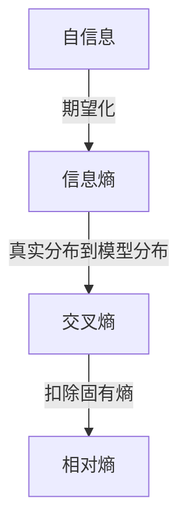
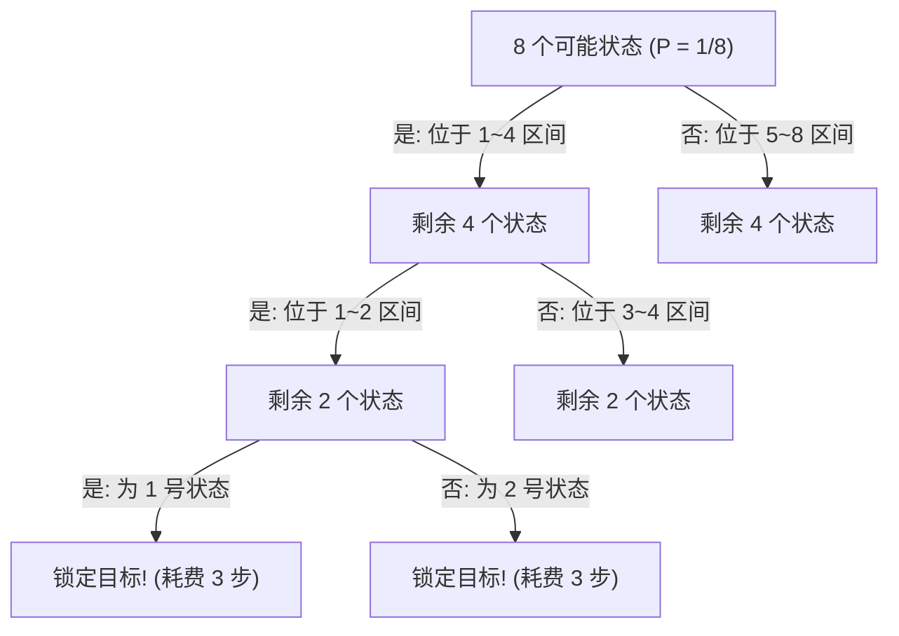
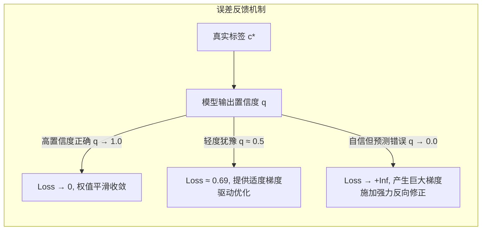

# 自信息、信息熵与交叉熵：直觉认知与严谨推导

---

## 0. 认知概览与记忆锚点（Mental Hooks）

在信息论与深度学习中，自信息、熵、交叉熵与相对熵（KL 散度）构成了概率建模的核心度量链条。为了在理解数学严密性的同时建立直观印象，可先掌握以下**核心认知锚点**：



> 🎯 **速记心法**：
> - **自信息**：单一事件发生的**意外程度**（概率越低，排除的竞争可能越多，自信息越大）。
> - **信息熵**：整个系统的**混乱程度**（事情越难猜、悬念越大，平均需要消除的不确定性越多）。
> - **交叉熵**：用**主观模型**去描述**客观真理**时的**总平均代价**。
> - **KL 散度**：主观模型因为**不够准确**而多付出的**额外偏差代价**。

> 💡 **为什么叫“自信息”而不直接叫“信息量”？**  
> 在日常语言里，“信息量”常常指“内容很多”“知识丰富”或“重要程度高”，这更偏语义和经验判断；但在信息论中，严格定义的对象是：**单个事件发生后，消除了多少先验不确定性**。因此，信息论中的术语更准确地叫做 **自信息（self-information）**，它强调的是“对某个事件本身所提供的惊讶度/不确定性消除量”，而不是泛义上的“内容多寡”。  
> 也就是说：**概率越小、事件越意外，自信息越大**。这是它与口语化“信息量”的根本区别。

---

## 1. 自信息（Information Content / Self-Information）

### 1.1 数学定义
设离散随机变量 $X$ 取某一特定值 $x_i$ 的先验概率为 $P(x_i)$。该事件发生所带来的**自信息** $I(x_i)$ 定义为：

$$I(x_i) = \log_b\left(\frac{1}{P(x_i)}\right) = -\log_b P(x_i)$$

*对数底数 $b$ 决定了信息度量单位*：
- 底数 $b=2$ 时，单位为**比特（bit / Shannon）**（计算机科学与深度学习中最常用）；
- 底数 $b=e$ 时，单位为**奈特（nat）**；
- 底数 $b=10$ 时，单位为**哈特利（hartley）**。

### 1.2 直觉解释：信息本质是“不确定性的消除量”
自信息不衡量事件的实际价值，也不衡量我们主观上有多意外；它只回答一个问题：**在观察结果之前，这个结果有多少种可能；现在得知结果后，缩小了多少未知范围。**

以随机号码生成器为例。每次按下按钮，系统都会独立且等概率地生成 $1$ 到 $8$ 中的一个号码。按下按钮前，你只知道结果是其中之一；屏幕显示“3”后，原本的 $8$ 种候选结果只剩下 $1$ 种：

$$I(\text{号码 3})=-\log_2\left(\frac{1}{8}\right)=3\text{ bit}$$

这里的 $3$ bit 可以理解为：若每次只能问一个“是/否”问题，最少约需 $3$ 次二分判断，才能从 $8$ 个号码中确定为号码 $3$。例如依次确认它是否在 $1$--$4$、是否在 $1$--$2$、是否为 $3$。

- **必然事件（$P=1$）**：若生成器被设定为每次只会输出号码 $3$，那么按下按钮前就已确定结果一定是 $3$；屏幕显示结果后，候选范围仍然是同一个结果，没有新增的确定性：
  $$I(\text{号码 3})=-\log_2(1)=0\text{ bit}$$
- **罕见事件（$P\to 0$）**：现在将生成器设为每次独立且等概率地输出 $1$ 到一亿中的一个号码。按下按钮前，输出可能是这一亿个号码中的任意一个；屏幕显示“73,581,246”后，一亿种候选只剩这一个：
  $$I(\text{号码 73,581,246})=-\log_2\left(\frac{1}{10^8}\right)\approx 26.6\text{ bit}$$
  候选号码越多，确认具体号码所需的二分判断越多，因此自信息越大。当一个结果的概率趋近于 $0$，等价于需要从越来越大的候选范围中确认它，所以其自信息趋于无穷大。

系统断电的例子也应按同一方式理解：收到“系统断电”告警，确定的是“系统当前状态”，而不是断电原因。若要确定原因，还需要把“市电异常、备用电源故障、切换失败”等作为另一个随机变量，再观察额外证据。

### 1.3 离散二分模型（为什么是对数关系？）
假设随机号码生成器等概率输出 $N$ 个候选状态中的一个（每个状态概率 $P = 1/N$）。若采用最优的二分排查法（每次询问一个“二选一”的 Yes/No 问题以排除一半候选）：



锁定这一个目标状态所必须的最少二分询问次数为：
$$\text{决策次数} = \log_2 N = \log_2\left(\frac{1}{P}\right) = -\log_2 P$$

*(注：当状态数 $N$ 并非 2 的整数次幂时，实际离散提问次数向上取整为 $\lceil \log_2 N \rceil$，而 $-\log_2 P$ 则精确给出了平均理论自信息的连续下界。)*

**结论**：**自信息在数值上严格对应：通过最优二分排查消除所有干扰假设、锁定该状态所必须消耗的二进制决策步数（bit）**。

---

## 2. 香农信息熵（Shannon Entropy）

### 2.1 数学定义
**信息熵**是离散随机变量 $X$ 的**自信息在整个概率空间上的数学期望**，用于量化系统整体在统计意义上的平均不确定性。

设离散随机变量 $X$ 拥有 $n$ 个可能取值 $\{x_1, x_2, \dots, x_n\}$，其概率质量分布为 $P(x)$，则系统的信息熵定义为：

$$H(P) = \mathbb{E}_{x \sim P}[I(x)] = -\sum_{i=1}^n P(x_i) \log_b P(x_i)$$

*边界规定*：当 $P(x_i) = 0$ 时，利用极限定理 $\lim_{p \to 0^+} p \log p = 0$，将该项约定计为 $0$。

### 2.2 直觉实例：生成号码前，平均还要排除多少可能
延续前面的随机号码生成器。**自信息**讨论“某次输出结果被观察者获知时，观察者获得了多少信息”；而**信息熵**讨论“按下按钮前，平均而言，观察者还需要获得多少信息才能获知输出结果”。

设每次按下按钮，生成器都独立地产生一个号码：

| 生成器的输出规则 | 按下按钮前的情况 | 信息熵的直观含义 |
| :--- | :--- | :--- |
| 总是输出 `3` | 不用按按钮也知道结果是 `3` | 没有不确定性，$H=0$ |
| 独立且等概率输出 `1` 或 `2` | 只能等结果显示后才知道是哪一个 | 平均需要 $1$ 次“是/否”判断，$H=1\text{ bit}$ |
| 独立且等概率输出 `1` 到 `8` | 每个号码都同样可能 | 平均需要 $3$ 次二分判断，$H=3\text{ bit}$ |

对于八张等可能号码签，任意一个号码的自信息都是 $3\text{ bit}$：

$$I(x)=-\log_2\left(\frac{1}{8}\right)=3\text{ bit}$$

因为每个号码出现的机会完全相同，所以抽到哪一个都需要同样多的信息来确定；其平均值仍是 $3\text{ bit}$：

$$H(X)=\sum_{i=1}^{8}\frac{1}{8}\times 3=3\text{ bit}$$

再看一个不均匀的抽签箱：$99$ 张是 `1` 号签，只有 $1$ 张是 `2` 号签。抽签前，直接猜 `1` 号通常就会猜对；因此，大多数时候只需很少的信息就能确定结果。偶尔抽到 `2` 号时，需要较多信息，但这种情况只占 $1\%$。将两种情况按发生概率取平均后，信息熵很小：

$$H(X)=-0.99\log_2(0.99)-0.01\log_2(0.01)\approx0.08\text{ bit}$$

**记忆锚点**：自信息看“一次结果”：看到这次生成的号码后，原来的未知减少了多少；信息熵看“很多次结果的平均”：每次按按钮前，平均还不知道多少。分布越平均，按按钮前越难猜中结果，信息熵越大。

### 2.3 最大熵原理与理论极限
对于具有 $n$ 个离散状态的系统，信息熵满足严格界限：

$$0 \le H(P) \le \log_b n$$

- **最小熵**：当且仅当某个状态概率为 $1$、其余全为 $0$ 时取得（系统完全确定，$H(P) = 0$）；
- **最大熵**：当且仅当所有状态等概率分布，即 $P(x_i) = \frac{1}{n}$ 时取得（系统最为均匀随机，$H(P) = \log_b n$）。

**物理意义（香农第一编码定理）**：信息熵给出了对该信源进行**无损压缩编码时的理论平均码长下界**。以 $D$ 进制符号对信源符号进行编码时，其平均码长 $L$ 必定满足：

$$L \ge \frac{H_2(P)}{\log_2 D} = H_D(P)$$

任何高效压缩算法的平均符号数均不可能突破信源熵所设定的物理极限。

---

## 3. 交叉熵（Cross-Entropy）与相对熵（KL 散度）

### 3.1 交叉熵定义：模型认知与客观事实的错配成本
在统计推断与监督学习中，同一随机变量通常涉及两个不同的概率分布：
- **$P(x)$**：样本真实的客观概率分布（Ground Truth，如标注标签）；
- **$Q(x)$**：模型给出的预测估计分布（Model Prediction）。

交叉熵衡量的是：在真实分布为 $P$ 的样本上，模型分布 $Q$ 给真实结果分配概率时所产生的**平均负对数损失**。模型给真实结果的概率越低，损失越大：

$$H(P, Q) = \mathbb{E}_{x \sim P}\big[-\log Q(x)\big] = -\sum_{x} P(x) \log Q(x)$$

### 3.2 相对熵（KL 散度 / Kullback-Leibler Divergence）
**相对熵**用于严格量化由模型分布 $Q$ 近似真实分布 $P$ 时，所造成的**纯额外信息损耗**：

$$D_{\text{KL}}(P \parallel Q) = \sum_{x} P(x) \log\left(\frac{P(x)}{Q(x)}\right)$$

根据吉布斯不等式（Gibbs' Inequality）：
$$D_{\text{KL}}(P \parallel Q) \ge 0$$
当且仅当 $Q(x) = P(x)$ 几乎处处成立时，$D_{\text{KL}} = 0$。

> ⚠️ **非对称性提示**：$D_{\text{KL}}(P \parallel Q) \ne D_{\text{KL}}(Q \parallel P)$，因此 KL 散度是一种统计散度（Divergence），而非严格度量空间中的“距离（Metric）”。

### 3.3 核心分解定理（三者关系）
通过简单的代数整理，可得出三者之间经典的积木拆解关系：

$$H(P, Q) = H(P) + D_{\text{KL}}(P \parallel Q)$$

```
┌───────────────────────────────────────────────────────────────┐
│                      交叉熵 H(P, Q)                            │
│           (用模型 Q 描述真实世界 P 所需的总信息开销)             │
├───────────────────────────────┬───────────────────────────────┤
│          信息熵 H(P)          │        KL 散度 D_KL(P 与 Q)   │
│   (客观世界不可逾越的固有下界)  │   (由于模型预估偏差造成的额外损耗) │
└───────────────────────────────┴───────────────────────────────┘
```

**工程推论（为什么深度学习直接优化交叉熵？）**：
在标准的监督学习任务中，训练数据集与其真实标签已经固定，因此真实分布的熵 $H(P)$ 是一个常数常项，对模型参数 $\theta$ 的梯度为零：

$$\nabla_{\theta} H(P, Q_{\theta}) = \nabla_{\theta} \big( \underbrace{H(P)}_{\text{常数项}} + D_{\text{KL}}(P \parallel Q_{\theta}) \big) = \nabla_{\theta} D_{\text{KL}}(P \parallel Q_{\theta})$$

**结论**：在参数优化视角下，**最小化交叉熵损失函数严格等价于最小化模型预测分布与真值分布之间的 KL 散度**。

---

## 4. 交叉熵在神经网络分类任务中的数学特性

### 4.1 One-Hot 标签下的退化与聚焦
在 $C$ 分类任务中，设单个样本的真实类别为 $c^* \in \{1, \dots, C\}$。
真实标签向量写为 One-Hot 形式：$P_i = y_i = 1$（当 $i = c^*$ 时），其余类别 $P_i = y_i = 0$。
网络未归一化得分（logits）记为 $\mathbf{z}$，经 Softmax 激活得到预测概率向量 $Q = \hat{\mathbf{y}}$：
$$q_i = \hat{y}_i = \frac{e^{z_i}}{\sum_{j=1}^C e^{z_j}}$$

在深度学习中，交叉熵损失默认采用**自然对数 $\ln$（底数为 $e$）**以方便梯度求导。将 One-Hot 真实分布 $P$ 带入公式，所有非真实类别因乘以 $0$ 直接被消除：

$$L_{\text{CE}} = -\sum_{i=1}^C y_i \ln \hat{y}_i = -\ln \hat{y}_{c^*}$$

这一退化展示了交叉熵在单样本分类中的本质：**损失大小仅由模型在“真实目标类别”上赋予的预测置信概率 $\hat{y}_{c^*}$ 单独决定**。

### 4.2 非线性惩罚特性与梯度表现
负对数函数 $-\ln(q)$ 展现出极其平滑且非线性的误差惩罚机制：



| 模型在真实类上的置信度 $\hat{y}_{c^*}$ | 损失值 $-\ln(\hat{y}_{c^*})$ | 优化状态诊断与梯度响应 |
| :--- | :--- | :--- |
| **0.99**（高度确信且正确） | **0.010** | 误差接近于 0，参数平稳收敛 |
| **0.50**（犹豫 / 欠拟合） | **0.693** | 存在明确的负反馈信号，推动概率进一步提升 |
| **0.10**（较大偏差误判） | **2.303** | 梯度显著增大，对网络权重进行快速修正 |
| **0.001**（严重且自信的误判） | **6.908** | 产生极强的损失响应，实施强阻尼纠偏 |

### 4.3 为什么分类任务优先选择交叉熵而非均方误差（MSE）？
当使用均方误差（MSE）配合 Sigmoid / Softmax 激活函数时：
$$L_{\text{MSE}} = \frac{1}{2}\sum_{i=1}^C (\hat{y}_i - y_i)^2$$
其对 logits $z_i$ 的导数中会包含激活函数本身的导数项 $\sigma'(z) = \hat{y}(1-\hat{y})$。当网络预测严重错误且处于饱和区（如输出 $\hat{y} \to 0$ 但真实标签为 $1$）时，激活函数导数趋近于 $0$，导致**梯度消失（Gradient Vanishing）**，模型难以通过反向传播完成纠偏。

而将**基于自然对数的交叉熵损失与 Softmax 结合**时，对数的求导与指数归一化完美抵消，输出层对未归一化 logits $z_i$ 的偏导呈现极其优美的线性差值形式：

$$\frac{\partial L_{\text{CE}}}{\partial z_i} = \hat{y}_i - y_i = q_i - P_i$$

*(注：若使用其他底数 $b$，导数将带入常数系数 $\frac{1}{\ln b}$；采用自然对数使得梯度形式最为精简。)*

**物理直觉**：**反向传播的误差梯度恰好等于预测概率与真实标签的直接残差（预测概率 - 真实标签）**。预测偏差越大，回传梯度越强；预测越准，梯度自然衰减至零，从根本上杜绝了饱和区更新停滞的问题。

---

## 5. 核心指标对比速查表

| 核心指标 | 标准数学表达式 | 核心物理/统计内涵 | 典型应用场景 |
| :--- | :--- | :--- | :--- |
| **自信息** $I(x)$ | $-\log_b P(x)$ | 单个离散事件排除不确定性的能力（消除歧义所需的二进制决策步数） | 异常检测、事件重要性加权 |
| **信息熵** $H(P)$ | $-\sum P(x) \log_b P(x)$ | 整个概率系统固有的平均不确定性，无损压缩编码的理论物理极限 | 信源压缩编码、决策树分裂准则（ID3/C4.5） |
| **交叉熵** $H(P, Q)$ | $-\sum P(x) \log_b Q(x)$ | 使用假设分布 $Q$ 编码服从真实分布 $P$ 的数据时付出的平均信息开销 | 神经网络多分类损失函数、自回归语言模型（LLM）训练 |
| **相对熵** $D_{\text{KL}}(P \parallel Q)$ | $\sum P(x) \log_b \frac{P(x)}{Q(x)}$ | 分布 $Q$ 偏离基准分布 $P$ 造成的额外信息损失（非对称统计散度） | 变分自编码器（VAE）、模型蒸馏（Knowledge Distillation） |

---

## 6. 核心认知回顾（3 秒锚点）

1. **自信息**：衡量“单个事件有多意外”（概率越低，排除的竞争选项越多，自信息越大）。
2. **信息熵**：衡量“整个系统有多混沌”（分布越均匀，悬念越充分，平均排查成本越高）。
3. **交叉熵**：衡量“用模型推测现实的总代价”（真实分布加权，模型预测概率受罚）。
4. **KL 散度**：衡量“模型偏离真理交的学费”（交叉熵扣除系统客观固有熵后的净偏差）。
