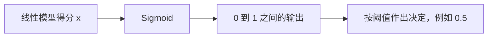

# Sigmoid 趣闻

## 一句话理解

Sigmoid 把一个可以是任意实数的“打分”转换成 $0$ 到 $1$ 之间的数。在二分类任务中，这个数通常被解释为某个类别发生的概率。

它是一种“柔和的二选一”：不像硬阈值那样只输出 $0$ 或 $1$，而是保留了模型对结果的确信程度。



## 一、Sigmoid 的起源

### 1. 名字的来源：S 形曲线

Sigmoid 一词来自希腊字母 sigma，通常泛指具有 S 形特征的函数。它的曲线从接近 $0$ 的位置开始，中间快速变化，最后逐渐靠近 $1$。

### 2. 最早的背景：受限增长模型

19 世纪，法国数学家 Pierre Francois Verhulst 用 logistic model 描述资源有限时的人口增长。人口少时增长缓慢，资源充足时增长加快，接近环境容量后又逐渐饱和，于是形成了 S 形增长曲线。

这里的关键思想是：现实中的增长通常不会无限持续。Sigmoid 后来被机器学习采用，也是因为它能表达“逐渐饱和”的变化。

### 3. 现代机器学习中的主要来源：logistic regression

Sigmoid 真正成为分类工具，主要来自统计学中的 logistic regression。它解决了一个直接而重要的问题：线性模型的输出可以是任意实数，但概率必须位于 $0$ 和 $1$ 之间。

因此，Sigmoid 可以看作连接“线性证据”和“概率”的桥梁：

```text
线性得分（log-odds） -> Sigmoid -> 概率
```

## 二、为什么需要 Sigmoid

假设直接用线性模型预测概率：

$$
p = w^T x + b
$$

当输入较大时，可能得到 $p=1.2$；当输入较小时，可能得到 $p=-0.5$。这两个结果都不可能是真正的概率。

Sigmoid 的作用就是把任意实数 $x\in(-\infty,+\infty)$ 压缩到 $(0,1)$，同时保持单调性：得分越大，输出越大。

## 三、公式与推导

### 1. Sigmoid 的公式

$$
\sigma(x)=\frac{1}{1+e^{-x}}
$$

在分类模型中，$x$ 通常不是原始特征，而是线性得分：

$$
x=w^T a+b
$$

所以完整写法是：

$$
p=\sigma(w^T a+b)=\frac{1}{1+e^{-(w^T a+b)}}
$$

### 2. 从概率到 log-odds

这一步是理解 Sigmoid 的关键：我们先把概率 $p$ 转换成 odds，再把 odds 转换成 log-odds，最后才得到 Sigmoid。

#### 第一步：概率变成 odds

设事件发生的概率为 $p$，不发生的概率为 $1-p$。几率（odds）表示“发生”和“不发生”的相对可能性：

$$
\mathrm{odds}=\frac{p}{1-p}
$$

例如：

- $p=0.5$ 时，$\mathrm{odds}=1$，表示发生与不发生的可能性相等；
- $p=0.8$ 时，$\mathrm{odds}=4$，表示发生的可能性是不发生的 $4$ 倍；
- $p=0.2$ 时，$\mathrm{odds}=0.25$，表示发生的可能性是不发生的 $1/4$。

因此，odds 把概率区间 $(0,1)$ 转换成了 $(0,+\infty)$。不过它仍然有一个问题：只能表示正数，不能直接和可以取任意实数的线性模型输出对应。

#### 第二步：odds 变成 log-odds

于是我们对 odds 取自然对数，得到对数几率（log-odds，也叫 logit）：

$$
\mathrm{logit}(p)=\ln\left(\frac{p}{1-p}\right)
$$

取对数有两个重要作用：

1. 把乘法关系变成加法关系，便于线性模型组合多个特征的影响；
2. 把正数区间 $(0,+\infty)$ 展开成完整的实数区间 $(-\infty,+\infty)$。

对应关系如下：

| 概率 $p$ | odds | log-odds |
| --- | --- | --- |
| $0.2$ | $0.25$ | $\ln(0.25)\approx-1.39$ |
| $0.5$ | $1$ | $0$ |
| $0.8$ | $4$ | $\ln(4)\approx1.39$ |

现在，概率为 $0.5$ 对应 log-odds $0$；偏向事件发生时，log-odds 为正；偏向事件不发生时，log-odds 为负。它的范围已经和线性模型的输出完全一致，因此可以令：

$$
\ln\left(\frac{p}{1-p}\right)=x
$$

这里的 $x$ 就是线性模型给出的得分。换句话说，逻辑回归并不是直接让线性模型预测概率，而是让它预测 log-odds：

$$
x=w^T a+b=\mathrm{logit}(p)
$$

最后再通过 logit 的反函数，把 $x$ 转回概率，这个反函数就是 Sigmoid。

### 3. 反解出概率 $p$

两边取指数：

$$
\frac{p}{1-p}=e^x
$$

移项并整理：

$$
p=e^x(1-p)
$$

$$
p+pe^x=e^x
$$

$$
p(1+e^x)=e^x
$$

$$
p=\frac{e^x}{1+e^x}
$$

分子分母同时除以 $e^x$：

$$
p=\frac{1}{1+e^{-x}}=\sigma(x)
$$

所以 Sigmoid 不是随意设计出来的公式，而是 logit 的反函数（inverse-logit）。它把线性得分还原成合法概率。

## 四、图像与核心性质

- **值域**：$\sigma(x)\in(0,1)$，但有限的 $x$ 不会真正得到 $0$ 或 $1$。
- **中点**：$x=0$ 时，$\sigma(0)=0.5$。
- **方向**：$x>0$ 时输出大于 $0.5$；$x<0$ 时输出小于 $0.5$。
- **单调**：输入越大，输出越大，因此模型的排序关系不会改变。
- **对称**：$\sigma(-x)=1-\sigma(x)$。
- **饱和**：$x$ 很大或很小时，曲线趋于平坦，继续改变输入对输出的影响很小。

### Sigmoid 的求导过程

从定义式开始：

$$
\sigma(x)=\frac{1}{1+e^{-x}}=(1+e^{-x})^{-1}
$$

对 $x$ 求导。外层是 $u^{-1}$，导数为 $-u^{-2}$；内层 $u=1+e^{-x}$ 的导数为 $-e^{-x}$。根据链式法则：

$$
\begin{aligned}
\sigma'(x)
&=-1(1+e^{-x})^{-2}\cdot(-e^{-x})\\
&=\frac{e^{-x}}{(1+e^{-x})^2}
\end{aligned}
$$

接着把结果改写成只含 $\sigma(x)$ 的形式。先分别写出：

$$
\sigma(x)=\frac{1}{1+e^{-x}}
$$

$$
1-\sigma(x)=1-\frac{1}{1+e^{-x}}
=\frac{e^{-x}}{1+e^{-x}}
$$

将两式相乘：

$$
\sigma(x)(1-\sigma(x))
=\frac{1}{1+e^{-x}}\cdot\frac{e^{-x}}{1+e^{-x}}
=\frac{e^{-x}}{(1+e^{-x})^2}
=\sigma'(x)
$$

因此：

$$
\boxed{\sigma'(x)=\sigma(x)(1-\sigma(x))}
$$

这个形式特别实用：前向传播已经算出 $\sigma(x)$ 后，反向传播不需要再单独计算指数函数。又因为 $0<\sigma(x)<1$，导数最大值出现在 $\sigma(x)=0.5$（即 $x=0$）处，最大为 $0.25$；两端的导数接近 $0$，这会带来梯度消失问题。

## 五、日常生活中的理解与案例

### 1. 带不带雨伞

可以把 $x$ 想成“下雨证据的综合得分”：乌云、天气预报和湿度共同决定它。

- $x=-3$：下雨证据很弱，输出接近 $0$
- $x=0$：证据正反相当，输出为 $0.5$
- $x=3$：下雨证据很强，输出接近 $1$

注意：这里的 $x$ 是证据得分，Sigmoid 的输出只有在模型经过合理训练和校准时，才适合严格解释为概率。

### 2. 垃圾邮件识别

模型可以综合发件人、关键词和链接数量，输出“这是垃圾邮件”的概率。若概率大于 $0.5$，系统可以先把邮件放入垃圾箱；更谨慎的系统也可以把阈值设为 $0.9$。

### 3. 风险判断与推荐

在贷款违约预测、医学辅助筛查、广告点击预测和推荐系统中，模型常需要输出一个事件发生的可能性。这些都是适合使用 Sigmoid 的二分类或单事件预测场景。

## 六、在机器学习中的使用位置

### 1. Logistic regression

逻辑回归通常先计算线性得分，再通过 Sigmoid 得到概率：

$$
p=\sigma(w^T x+b)
$$

训练时常配合 binary cross-entropy（binary log loss）使用。

### 2. 神经网络的二分类输出层

当任务只有一个目标类别，例如“有病/无病”或“点击/不点击”，输出层通常使用一个 Sigmoid 单元。

### 3. 神经网络中的门控

LSTM、GRU 等结构也会使用 Sigmoid 产生 $0$ 到 $1$ 之间的门控值，表示“保留多少信息”或“放行多少信息”。这时它不一定代表概率，而更像一个连续的开关。

## 七、Sigmoid 与 Softmax 的区别

- **Sigmoid**：每个输出独立表示一个事件的概率，最典型的是单标签二分类。
- **Softmax**：把多个得分转换成总和为 $1$ 的概率分布，最典型的是多个互斥类别中选择一个。

例如，“这封邮件是不是垃圾邮件”适合 Sigmoid；“图片是猫、狗还是鸟”通常适合 Softmax。多标签分类中，即使有多个类别，也可以为每个类别分别使用 Sigmoid。

## 八、优点与局限

### 优点

- 输出范围天然符合概率的取值范围
- 连续、平滑、处处可导
- 结果容易解释，适合二分类输出
- 数学形式简洁，导数计算方便

### 局限

- 两端容易饱和，导致梯度接近 $0$
- 输出不是以 $0$ 为中心，可能影响深层网络的优化
- 在深层隐藏层中，通常 ReLU 及其变体更容易训练
- 输出接近 $0$ 或 $1$ 时，数值计算需要注意溢出和下溢问题

因此，Sigmoid 现在最常见的位置是二分类输出层和门控结构，而不是所有隐藏层的默认激活函数。

## 九、记忆要点

可以用四句话记住 Sigmoid：

1. 线性模型给出任意实数得分。
2. log-odds 为这个得分提供了统计学解释。
3. Sigmoid 是 logit 的反变换，把得分变成 $0$ 到 $1$ 之间的输出。
4. 它是柔和的二分类开关，但两端会饱和。

**一句话总结：Sigmoid 把一个信号强度翻译成一个受限、可解释的输出；在合适的模型训练和校准下，这个输出可以表示一个概率。**
