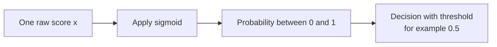

# Sigmoid

## One-sentence idea
Sigmoid turns a single score into a probability between $0$ and $1$.

If the score is large and positive, the output is close to $1$.
If the score is very negative, the output is close to $0$.

## Introduction
Think of a hard binary decision first:

- hard threshold: output is exactly $0$ or exactly $1$

Sigmoid is the soft version of that idea:

- it keeps outputs continuous between $0$ and $1$
- it still preserves ranking: bigger score means bigger probability
- it is more informative than a hard yes/no output

So when a model needs one probability, sigmoid is often the first choice.

## Sigmoid diagram
Here is the basic flow:



This is the whole idea in one line: one score goes in, one probability comes out.

## Why it is called sigmoid
The curve has an S-like shape.
The word sigmoid means S-shaped, and the function smoothly moves from values near $0$ to values near $1$.

## The core formula

For input $x$:

$$
\sigma(x) = \frac{1}{1 + e^{-x}}
$$

What this does:

- keeps the output in the range $(0,1)$
- makes larger inputs map to larger probabilities
- changes smoothly, so small input changes cause small output changes

## Where it comes from
Sigmoid has three roots that later meet in machine learning:

1. Growth modelling in the 1830s (Verhulst)
2. Probability modelling in statistics (logistic regression)
3. Smooth activation in neural networks

### 1) Historical root: logistic growth
Pierre Francois Verhulst introduced the logistic model to describe population growth with limited resources.
Its solution has an S-shape: slow growth at first, rapid growth in the middle, then saturation.
That same S-shape is the geometric reason the curve is called sigmoid.

### 2) Statistical root: log-odds to probability
In binary classification, we want a probability $p \in (0,1)$.
But a linear model naturally outputs any real value $(-\infty, +\infty)$, not a valid probability range.

So statistics introduces a bridge variable in two steps:

1. odds: $\dfrac{p}{1-p}$, which maps probability to $(0, +\infty)$
2. log-odds (logit): $\log \dfrac{p}{1-p}$, which maps to $(-\infty, +\infty)$

Now the range matches a linear score perfectly, so we model:

$$
\log \frac{p}{1-p} = x
$$

This is why the odds equation appears: it is the mathematically natural way to connect

- unrestricted linear evidence $x$
- constrained probability $p \in (0,1)$

Now solve for $p$ step by step:

$$
\frac{p}{1-p} = e^x
$$

$$
p = e^x(1-p)
$$

$$
p + pe^x = e^x
$$

$$
p(1+e^x)=e^x
$$

$$
p = \frac{e^x}{1+e^x} = \frac{1}{1+e^{-x}} = \sigma(x)
$$

So sigmoid is not an arbitrary formula. It is exactly the inverse-logit transform:

- input: log-odds score $x$
- output: probability $p$

Interpretation shortcut:

- $x=0 \Rightarrow p=0.5$
- $x>0 \Rightarrow p>0.5$
- $x<0 \Rightarrow p<0.5$

### 3) Machine-learning root: smooth and differentiable gate
Neural networks adopted sigmoid because it is smooth and differentiable everywhere.
Before ReLU became dominant, sigmoid was widely used to introduce nonlinearity.
It is still very common for binary-output layers because the output is directly interpretable as probability.

### Why this origin story matters
You can remember sigmoid as a translation pipeline:

```text
linear evidence (log-odds) -> sigmoid -> probability
```

That is why sigmoid naturally appears in logistic regression, binary classifiers, and many probabilistic decision systems.

## A daily-life memory hook
Imagine you are deciding whether to carry an umbrella.

- Input score $x$: how strongly the weather signals suggest rain
- Sigmoid output: your estimated probability of rain

Example intuition:

- if $x = -3$, probability is very low (close to $0$)
- if $x = 0$, probability is $0.5$
- if $x = 3$, probability is high (close to $1$)

So sigmoid behaves like a soft yes/no switch.

## Where sigmoid is used
Sigmoid is common when we need one probability output:

1. Binary classification, such as spam vs non-spam
2. Logistic regression output layer
3. Neural networks when modelling a yes/no probability

## Quick comparison with softmax

- sigmoid: one score to one probability
- softmax: many scores to a probability distribution that sums to $1$

If there are only two classes, sigmoid is usually the simpler choice.

## One-line memory hook
Sigmoid translates one signal strength into one probability.

# 总结
Sigmoid is not an arbitrary equation. It is a natural way to convert a linear score into a valid probability.

If we directly predict probability with a linear form,

$$
p = w^T x + b
$$

then $p$ can be greater than $1$ or smaller than $0$, which is invalid for probability.

例如：输入很大时，可能得到 $p=1.2$（120%）；输入很小时，可能得到 $p=-0.5$（-50%）。

为了解决这个问题，可以分两步理解：

1. 第一步：引入几率（odds）打破上限

定义：

$$
\mathrm{odds}=\frac{p}{1-p}
$$

- 当 $p=0$ 时，odds $=0$
- 当 $p=0.5$ 时，odds $=1$
- 当 $p\to1$ 时，odds $\to+\infty$

这一步把概率区间 $(0,1)$ 映射到了 $(0,+\infty)$。

2. 第二步：引入对数几率（log-odds）打破下限

定义：

$$
\mathrm{log\text{-}odds}=\ln\left(\frac{p}{1-p}\right)
$$

- 当 odds 接近 $0$ 时，$\ln(\mathrm{odds})\to-\infty$
- 当 odds 趋向无穷大时，$\ln(\mathrm{odds})\to+\infty$

这一步把范围进一步变成了 $(-\infty,+\infty)$，与线性模型输出范围完全匹配。

最后，通过反变换得到 sigmoid：

$$
p = \frac{1}{1+e^{-x}}
$$

所以 sigmoid 的本质是：把“任意实数打分”稳定地映射成“合法概率”。
