# Softmax

## One-sentence idea
Softmax turns a list of scores into a probability list that adds up to $1$.

If the scores are bigger, the probabilities become bigger too. It does not make a hard decision immediately. Instead, it says, “this one is most likely, but the others still have some chance.”

## Why it is called softmax
Think of the usual max function:

$$
\max([2, 1, 0]) = 2
$$

That gives only one winner. Softmax is a softer version of that idea:

- the biggest score gets the largest probability
- the other scores are not thrown away
- the output is smooth, not a hard yes/no choice

So “softmax” means “soft maximum”.

## The core formula

For scores $z_1, z_2, \dots, z_n$:

$$
\mathrm{softmax}(z_i) = \frac{e^{z_i}}{\sum_{j=1}^{n} e^{z_j}}
$$

What this does:

- exponentials stretch the difference between scores
- the denominator normalises everything so the total becomes $1$

That is why the result can be read as probabilities.

## Where it comes from
Softmax is closely related to the Boltzmann distribution from physics.

In physics, a lower-energy state is more likely:

$$
P(i) = \frac{e^{-E_i/(kT)}}{\sum_j e^{-E_j/(kT)}}
$$

In machine learning, we usually work with scores or logits instead of energy:

$$
z_i \approx -E_i
$$

So softmax is basically the same idea rewritten for model scores:

$$
P(i) = \frac{e^{z_i/T}}{\sum_j e^{z_j/T}}
$$

That is why softmax is often described as the machine-learning version of the Boltzmann distribution.

## A daily-life memory hook
Imagine choosing lunch after work.

You have three options:

- Restaurant A: your favourite food and close by
- Restaurant B: decent food, a bit farther
- Restaurant C: okay, but not exciting

You do not always choose A with 100% certainty. You are just much more likely to choose A.

Suppose you give the restaurants scores:

$$
[2, 1, 0]
$$

Then softmax gives:

$$
\frac{[e^2, e^1, e^0]}{e^2 + e^1 + e^0}
= [0.665, 0.245, 0.090]
$$

So you can remember it like this:

- Restaurant A: $66.5\%$
- Restaurant B: $24.5\%$
- Restaurant C: $9.0\%$

The best choice gets the most probability, but the others are still possible.

## Another easy example: choosing a route home
Imagine three routes:

- Route A: fastest
- Route B: slightly slower but reliable
- Route C: longest, but scenic

If the scores are $[3, 2, 0]$, then softmax gives approximately:

$$
[0.705, 0.259, 0.035]
$$

This means:

- Route A is most likely
- Route B still has a real chance
- Route C is unlikely, but not impossible

That is exactly what softmax is good at: ranking choices without forcing a hard winner too early.

## Where softmax is used in daily machine-learning tasks
Softmax appears whenever a model must choose between multiple options:

1. Classifying an image as cat, dog, or bird
2. Picking the next word in a language model
3. Ranking search results
4. Recommending a video, song, or product
5. Choosing one action from several possible actions in reinforcement learning

In all of these cases, the model first produces raw scores, then softmax turns them into probabilities.

## Temperature: how confident should the model be?
**Temperature controls how sharp or flat the probabilities are.**

- Small $T$: more peaky, one choice dominates
- Large $T$: flatter, choices become closer together

Using the same scores $[2, 1, 0]$:

```mermaid
xychart-beta
    title "Softmax probabilities vs temperature (scores [2,1,0])"
    x-axis [Option A, Option B, Option C]
    y-axis "Probability" 0 --> 1
    bar "T = 0.5" [0.867, 0.117, 0.016]
    bar "T = 1.0" [0.665, 0.245, 0.090]
    bar "T = 2.0" [0.506, 0.307, 0.186]
```



Memory trick:

- lower temperature = more confident
- higher temperature = more exploratory

## What to remember in one line
Softmax is a way to turn “how good each option looks” into “how likely each option is”, with the best option getting the most weight but not all of it.

## Quick recall formula
If you forget everything else, remember this pattern:

```text
score -> e^(score) -> divide by total -> probabilities
```

That is the whole idea.
