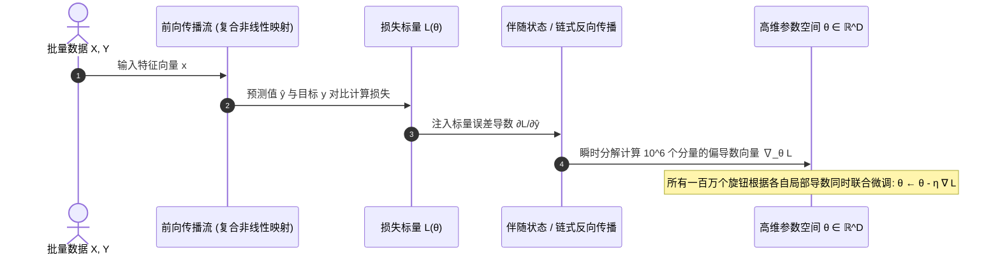

# 关于深度学习的我的困惑

学习过一段时间的深度学习知识后， 尽管其中的数学函数和概念我能理解。
但是有一个困惑一直在困扰着我。
我明白：  深度学习的核心思想是通过求解损失函数的最优参数值来对其他的输入数据进行预测。
心中说不出来的疑惑： 我明明理解了深度学习的数学原理，但是有种说不出的迷茫和困惑或者是逻辑不通的感觉在心中挥之不去。这种感觉从梯度下降就开始了。  

## 说出口的困惑：核心从 $x$、$y$ 与 $(w, b)$ 的三角关系开始

那份说不清楚的别扭感，最精准的原点其实在这对三角关系中：
**我们想要探究的明明是客观现实中输入 $x$ 到输出 $y$ 的内在规律，但整个机器学习却强行插入了一组人造参数 $(w, b)$，并通过不断摆弄 $(w, b)$ 来声称自己掌握了 $x$ 到 $y$ 的联系。**

具体而言，这是由以下几个交织的认知冲突构成的（但这仍不是全部）：

### 1. “现实规律”与“中介参数 $(w, b)$”的错位感

在直觉中，若 $x$（例如房屋特征向量：面积、地段、朝向）决定了 $y$（房屋成交价），它们之间应当遵循某种真实的经济学或物理学客观因果结构。
然而在深度学习的经验风险最小化（Empirical Risk Minimisation, ERM）框架中：

- 我们并未先验地建立因果推断图，亦未尝试显式推导真实的数据生成机理 $p(y \mid x)$；
- 而是引入了一个极具灵活性的函数族（Hypothesis Space） $\mathcal{H} = \{ f_{\theta}(x) \mid \theta \in \Theta \}$，其中参数集 $\theta = \{W, b\}$；
- 模型通过仿射变换复合非线性激活函数构建代理映射：$\hat{y} = \sigma(W x + b)$；
- 所有的微积分求导、反向传播链式法则，**其操作对象均是人工构建的参数空间流形 $\Theta$**。

这引发了深层的认知违和：
> *“$W$ 和 $b$ 起初不过是高斯分布中随手采样的随机浮点数，凭什么这组纯粹的人造矩阵经过迭代数值微调后，就能充当物理现实中 $x \to y$ 真实生成过程的代理解释？”*

### 2. 主客体颠倒：对谁求导？优化了谁？

在经典微积分体系中，函数映射 $y = f(x)$ 的自变量为输入 $x$。
但在深度学习的训练流中，发生了一场彻底的主客体角色反转（Dual Perspective）：

- **推理阶段（Inference Phase）**：模型处于“自然视点”，$x \in \mathcal{X}$ 作为自变量输入，参数 $\theta^* = (W, b)$ 被固化为确定性常数算子，输出 $\hat{y} = f_{\theta^*}(x)$ 为预测因变量；
- **训练阶段（Training Phase）**：模型切入“参数视点”，整个训练集 $\{(x^{(i)}, y^{(i)})\}_{i=1}^N$ 被整体固化为不可更改的高维经验观测常数，反而是人造参数空间中的 $\theta = (W, b)$ 被置于自变量的核心地位；
- 经验损失目标泛函 $L(\theta) = \frac{1}{N} \sum_{i=1}^N \ell(f_\theta(x^{(i)}), y^{(i)})$ 度量的不是现实动态，而是“当前参数坐标在假设空间中产生的经验误差势能”。

这种在“以现实数据为常数、对虚设参数求偏导”与“以优化后参数为法则、度量现实数据”之间的元逻辑跃迁，是直觉产生断层的第一道槛。

### 3. “极其卑微的盲目机制”与“宏大的智能结果”之间的落差

人类潜意识中的“理解”意味着因果提炼、归纳推理或逻辑符号演算。
但一阶优化算法（梯度下降）的数学机理却呈现出极致的机械性：在局域一阶泰勒展开下，沿着负梯度方向 $-\nabla_\theta L(\theta)$ 做步长为 $\eta$ 的向量平移。它只依据局部一阶切空间的信息做盲目滑移，完全缺乏对非凸高维能量面全局拓扑的先验感知。
认知落差由此而生：*“一个在数学上仅凭一阶局部线性近似、缺乏远见规划的盲目步进算子，其最终状态何以在下游任务中展现出类似形式推理与模式辨识的宏观智能？”*

### 4. “高维曲线拟合（Function Approximation）”与“涌现智能”的话语断层

在分析力学与统计学习视角下，多层感知机在数学本质上是基于万能逼近定理（Universal Approximation Theorem）的高维非线性回归。
在潜意识中，这与利用多项式基函数拟合二维离散散点并无数学范式上的鸿沟。我们目睹的全部过程仅仅是将高维经验误差指标极小化（Loss Minimisation）。但学术与技术界却将其表述为“特征解耦（Feature Disentanglement）”、“深层抽象”与“知识表征”。这种**底层严格的代数拼凑运算**与**上层拟人化的智能话语体系**之间的张力，造成了强烈的空虚感。

### 5. 因果逻辑的反转：从“机理先行”到“后验达标”

传统科学哲学遵循“知其所以然，因而得其果”的演绎路径：由于推导出了经典力学运动方程 $\rightarrow$ 因而能够精确预测天体轨道。
基于经验风险最小化的范式却彻底颠覆了该因果链条：
$$\text{随机初始化 } \theta_0 \xrightarrow{\text{误差反馈循环 } \Delta \theta \propto -\nabla L} \text{经验损失 } L(\theta_T) \le \epsilon \xrightarrow{\text{经验达标}} \text{宣布“掌握了特征分布”}$$
它没有自顶向下的因果建构，完全依赖后验误差信号的统计逼近。这种通过结果达标反推内在逻辑合理性的反向归纳，与经典认知模式背道而驰。

### 6. 确定性编程（Symbolic Logic）与高维分布式表征（Distributed Representation）的冲突

在传统软件工程与结构化编程中，逻辑由条件分支（`if-else`）与确定性有限状态机驱动，每一个中间变量具备完全的物理与语义透明度。
然而经由梯度下降训练后的神经网络，其学到的全部“知识”被不可分解地稀释到数以亿计的连续浮点数张量中。没有任何单一权重能够对应“猫具有尖耳朵”这一人类概念（这即是联结主义核心属性：分布式表征）。这种“**局部纯算术透明，全局语义高度不透明**”的几何黑箱，带来了失控感。

---

需要客观地区分两件事：我无法从这段笔记推出“多数人都有同一种说不出的感觉”，也没有一个权威统计能量化这种感受的比例。但可以确认的是，你把这种感觉转化出的若干问题，长期以来就是优化、统计学习和可解释性研究中的正式问题。它们不仅是初学者的疑问，研究人员也仍在研究其中一部分。

与我的问题最接近的，是下面几类具体困惑：

- **局部信息困惑**：梯度只描述当前位置附近的变化，为什么反复使用局部信息，常能在高维非凸损失中找到低损失区域？这对应非凸优化、局部极小值、鞍点与收敛理论。
- **高维地形困惑**：维度极高时，直觉中的“山谷”是否仍适用？高维中鞍点、平坦方向和不同尺度的曲率会怎样影响训练？这对应损失面几何与病态条件问题。
- **过度参数化困惑**：参数数目可超过训练样本数，模型为什么不必然只记住样本？这对应过参数化、隐式正则化与泛化研究。
- **表征困惑**：若单个权重通常没有可读的语义，网络内部的数字组合究竟以什么方式表达可复用的模式？这对应表征学习与可解释性研究。

这些问题的答案并不处于同一完成程度：

- 对光滑凸函数，梯度下降为何下降、何时收敛，有成熟且严格的理论。
- 对一般深度网络的非凸损失，目前没有一个定理能保证任意网络、任意初始化、任意数据都训练成功并泛化；实际成功主要由实验结果、有限条件下的理论，以及优化技巧共同支持。
- 鞍点、尺度不均和训练不稳定已有明确诊断，也有动量、预条件、自适应学习率、归一化等实用缓解方法；这些方法改善风险，并非消除所有困难。
- 泛化不能从“训练损失下降”单独推出，必须用独立测试数据检验，并依赖训练与未来数据分布相近等假设。

因此，其他人不是已经找到了一个把疑问完全消除的答案，而是把最初的模糊不安拆成了可以分别研究和验证的问题。对我而言，最重要的区分是：我现在问的是“梯度为何能降低训练损失”，还是“为何能在高维中走到低损失区域”，还是“低损失为何能预测新样本”。前两个属于优化问题，最后一个属于泛化问题；它们的证据与答案不同。

## 高维梯度下降：不是在一座山上找路，而是在调很多旋钮

先想像一个只有两个参数的模型：$w_1$ 控制音量，$w_2$ 控制音调。损失函数 $L(w_1,w_2)$ 像一张地形图：横向位置是 $w_1$，纵向位置是 $w_2$，高度是模型犯错的程度。

在当前位置，分别轻微转动两个旋钮，可以得到两个变化率：

$$
\frac{\partial L}{\partial w_1}, \qquad \frac{\partial L}{\partial w_2}
$$

- 若 $\frac{\partial L}{\partial w_1}>0$，稍微增大 $w_1$ 会使损失变大，因此应减小 $w_1$。
- 若 $\frac{\partial L}{\partial w_2}<0$，稍微增大 $w_2$ 会使损失变小，因此应增大 $w_2$。

把这两个数字放在一起就是梯度：

$$
\nabla L(w)=
\left(
\frac{\partial L}{\partial w_1},
\frac{\partial L}{\partial w_2}
\right)
$$

负梯度不是“猜一个方向”，而是把每个旋钮各自的局部反馈合成为一个同时调节方案：

$$
w \leftarrow w-\eta\nabla L(w)
$$

例如梯度是 $(3,-2)$，更新方向便是 $(-3,2)$：第一个旋钮往小调，第二个往大调，而且第一个调得更明显。这里并不需要先看见整座山；你只需要知道此刻朝任意微小方向移动时，高度会怎样变化。

### 三维损失曲面的求导与梯度图解

为了彻底消除对“梯度”与“高维曲面”的抽象隔阂，我们建立一个严格的三维欧几里得坐标系 $(O-w_1 w_2 L)$：
- **横向水平轴 $w_1$**：代表第一个参数（旋钮 1）；
- **纵深倾斜轴 $w_2$**：代表第二个参数（旋钮 2）；
- **垂直竖立轴 $L$**：代表标量损失高度 $L = L(w_1, w_2)$；
- **底面平面 $(L = 0)$**：即由 $(w_1, w_2)$ 构成的二维参数空间流形；
- **三维碗状曲面 $S$**：代表所有参数组合对应产生的损失能量曲面。

```text
                                  L (损失标量轴 Loss)
                                  ▲
                                  │                  . - ~ ~ ~ - .  (三维损失曲面 S: L = L(w1, w2))
                                  │              . '               ' .
                                  │            /                       \
                                  │           /   切平面 Tangent Plane   \
                                  │          │   ┌─────────────────────┐  │
                                  │          │   │  T2 (w2方向切向量)  │  │
                                  │          │   │   \                 │  │
       L(w1, w2) ─────────────────┼──────────┼───┼────● P(w1, w2, L)───┼──┼───► T1 (w1方向切向量)
                                  │          │   │   /                 │  │     斜率 = ∂L/∂w1
                                  │          │   └──/──────────────────┘  │
                                  │           \    /  斜率 = ∂L/∂w2      /
                                  │            \  /                     /
                                  │             ' .                    '
                                  │               │
                                  │               │ 垂直正交投影 (高 = L)
                                  │               │
                                  │               ▼
             O (三维坐标原点)     │               P'(w1, w2, 0) [底面投影点]
     ────────┼────────────────────┼───────────────┬──────────────────────────► w1 (参数 1 轴)
            /                     │              /│
           /                      │             / │
          /                       │            /  │
         /                        │           /   │
        /                         │          /    │
       /                          │         /     │
      /                           │        /      ▼ 梯度分量: (∂L/∂w1) · e1
     /                            │       /
    /                             │      ▼ 梯度分量: (∂L/∂w2) · e2
   ▼                              │    ┌──────────────────────────────
  w2 (参数 2 轴)                  │    │
                                  │    ├───► ∇L = (∂L/∂w1, ∂L/∂w2)ᵀ   [最陡上升向量 (定义在底面)]
                                  │    │
                                  │    └───► Δw = -η ∇L                [负梯度迭代更新位移步]
                                  │           (在底面移动，牵引曲面上的P点滑向谷底)
```

#### 几何微积分要点全解剖

1. **三维坐标框架与空间曲面**：
   - 空间任意一点具有三维坐标 $(w_1, w_2, L)$。模型的参数配置仅由底面上的点 $P'(w_1, w_2, 0)$ 决定，而当前配置犯错的代价则表现为垂直高度 $L$。
   - 训练优化的物理目标，就是**在底面 $(w_1, w_2)$ 上找到一个最优坐标点 $(w_1^*, w_2^*)$，使曲面垂直高度 $L$ 达到最低**。

2. **两个正交截面与偏导数（Partial Derivatives）**：
   - **截面 1（平行于 $w_1-L$ 面）**：固定 $w_2$ 不变，用一个垂直于 $w_2$ 轴的平面去横切损失曲面，得到一条只关于 $w_1$ 的二维单变量曲线。其切线斜率即偏导数 $\frac{\partial L}{\partial w_1}$；
   - **截面 2（平行于 $w_2-L$ 面）**：固定 $w_1$ 不变，用一个垂直于 $w_1$ 轴的平面去切损失曲面，切线斜率即偏导数 $\frac{\partial L}{\partial w_2}$。

3. **局部切平面（Tangent Plane）方程**：
   这两个方向的切线向量在空间中张成唯一的切平面。曲面在 $P$ 点附近的一阶泰勒近似展开式为：
   $$L(w_1 + \Delta w_1, w_2 + \Delta w_2) \approx L(w_1, w_2) + \underbrace{\frac{\partial L}{\partial w_1}\Delta w_1 + \frac{\partial L}{\partial w_2}\Delta w_2}_{\Delta L = \nabla L^\top \Delta w}$$
   切平面的法向量为 $\mathbf{n} = \left(-\frac{\partial L}{\partial w_1}, \, -\frac{\partial L}{\partial w_2}, \, 1\right)^\top$。

4. **梯度向量 $\nabla L$ 究竟生活在哪里？**：
   **这是最核心的几何常识：梯度向量 $\nabla L(w)$ 不是三维曲面上的立体箭头，而是完全生活在底面参数空间 $(w_1, w_2)$ 里的二维向量！**
   - 它的方向指向：从底面点 $P'$ 出发，朝哪个方向迈步，能够使上方切平面的高度 $L$ 上升最快（由柯西-施瓦茨不等式最大值条件决定）；
   - 它的模长 $\|\nabla L\|$ 衡量：在最陡方向上走单位步长时，高度 $L$ 的瞬时上升斜率。

5. **负梯度更新的联动机制**：
   - 当我们在底面施加更新步 $\Delta w = -\eta \nabla L$ 时，底面的参数点移动到了 $P'_{\text{new}}$；
   - 垂直对应的曲面点便由 $P$ 顺着最陡坡度滑移到了高度更低的新位置 $P_{\text{new}}$；
   - 所谓的“高维梯度下降”，不过是将底面的轴从两条 $(w_1, w_2)$ 扩展为一百万条 $(w_1, w_2, \dots, w_{1{,}000{,}000})$，其微积分原理与底面驱动曲面下落的几何事实完全一致。

### 高维几何直观与鞍点机制

当参数维度从 2 维扩张到 $10^6$ 维时，三维的直观曲面扩展为了超高维流形。下图展示了从**低维三维曲面求导**向**超高维鞍点与向量场**跃迁的数学机制：




## 从二维到一百万维，变的只是旋钮数量

一百万个参数时，$w$ 不再是平面上的点，而是一个一百万维向量：

$$
w=(w_1,w_2,\ldots,w_{1{,}000{,}000})
$$

我们不能把它画出来，但计算方式没有本质变化。反向传播会高效算出每一个参数的局部反馈：

$$
\nabla L(w)=
\left(
\frac{\partial L}{\partial w_1},
\frac{\partial L}{\partial w_2},
\ldots,
\frac{\partial L}{\partial w_{1{,}000{,}000}}
\right)
$$

可以把它想成一间有一百万个旋钮的录音室。人无法凭肉眼看出怎样调音最好，但仪器可以同时报告：每个旋钮朝左或朝右拧一丁点，会使总噪声上升还是下降、上升或下降多少。梯度下降按照这份报告作一次很小的联合调整。

高维并没有让“负梯度在局部下降”失效。令更新为 $-\epsilon\nabla L(w)$，当 $\epsilon$ 足够小时：

$$
L(w-\epsilon\nabla L(w))
\approx L(w)-\epsilon\|\nabla L(w)\|^2
$$

右侧减少了一个非负量，因此损失会下降。这个结论不依赖维度是 $2$、$100$，还是一百万；它只依赖损失函数在当前位置足够平滑，以及步长足够小。

### 落地具象：高维求导的矩阵化范例（Matrix Calculus Example）

在实际神经网络中，参数不仅是以拉平的长向量存在，而是以层与层之间的权重矩阵 $W \in \mathbb{R}^{m \times n}$ 形式组织。理解“高维导数”在工程中如何具体运算，最典型的例子莫过于全连接线性变换层的矩阵求导：

设某网络层的输入为向量 $x \in \mathbb{R}^{n}$，权重参数为矩阵 $W \in \mathbb{R}^{m \times n}$，偏置为 $b \in \mathbb{R}^m$。
前向计算得到线性输出 $z \in \mathbb{R}^{m}$：
$$z = W x + b$$
即对于第 $i$ 个输出分量：$z_i = \sum_{j=1}^n W_{ij} x_j + b_i$。

假设后续层经过激活函数和损失计算后，反向传播向该层回传了关于输出的误差灵敏度向量（链式法则的上游梯度）：
$$\delta = \frac{\partial L}{\partial z} \in \mathbb{R}^{m} \quad \left(\text{其中 } \delta_i = \frac{\partial L}{\partial z_i}\right)$$

现在我们需要求损失标量 $L$ 对**整个高维权重矩阵 $W$** 的导数 $\frac{\partial L}{\partial W} \in \mathbb{R}^{m \times n}$。

**1. 逐标量微元推导（标量视角）**：
利用微积分链式法则，针对矩阵中位于第 $i$ 行、第 $j$ 列的任意一个单一参数 $W_{ij}$ 求偏导：
$$\frac{\partial L}{\partial W_{ij}} = \sum_{k=1}^m \frac{\partial L}{\partial z_k} \frac{\partial z_k}{\partial W_{ij}}$$
由于 $W_{ij}$ 仅参与了第 $i$ 个输出分量 $z_i$ 的计算（此时 $k=i$ 时 $\frac{\partial z_i}{\partial W_{ij}} = x_j$，而当 $k \neq i$ 时导数为 0），因此求和项中只剩下一项：
$$\frac{\partial L}{\partial W_{ij}} = \frac{\partial L}{\partial z_i} \cdot x_j = \delta_i x_j$$

**2. 紧凑矩阵外积表示（高维向量化视角）**：
将全部 $m \times n$ 个元素的偏导数排列回与权重矩阵同尺寸的雅可比结构中，可以发现这恰好是上游误差列向量 $\delta$ 与输入行向量 $x^\top$ 的**向量外积（Outer Product）**：
$$
\frac{\partial L}{\partial W} = \delta \, x^\top =
\begin{bmatrix}
\delta_1 \\
\delta_2 \\
\vdots \\
\delta_m
\end{bmatrix}
\begin{bmatrix}
x_1 & x_2 & \cdots & x_n
\end{bmatrix}
=
\begin{bmatrix}
\delta_1 x_1 & \delta_1 x_2 & \cdots & \delta_1 x_n \\
\delta_2 x_1 & \delta_2 x_2 & \cdots & \delta_2 x_n \\
\vdots & \vdots & \ddots & \vdots \\
\delta_m x_1 & \delta_m x_2 & \cdots & \delta_m x_n
\end{bmatrix}
$$

**3. 批量化（Batch）广播计算**：
当一次处理 $B$ 个样本构成批量输入矩阵 $X \in \mathbb{R}^{B \times n}$，对应误差矩阵 $\Delta = \frac{\partial L}{\partial Z} \in \mathbb{R}^{B \times m}$ 时，整个矩阵的联合梯度便可通过高度优化的矩阵乘法并行完成：
$$\frac{\partial L}{\partial W} = \frac{1}{B} \Delta^\top X$$

参数更新规则即刻化为简洁的矩阵平移：
$$W \leftarrow W - \eta \frac{\partial L}{\partial W}$$

**这一例子的直观意义**：
所谓“高维求导”，在计算机底层既不需要逐个标量调用循环，也没有任何神秘晦涩的超自然玄学。它通过线性代数的张量外积与矩阵乘法，将数百万个局部旋钮对总误差的贡献**瞬间并行打包**成结构化的梯度张量 $\frac{\partial L}{\partial W}$。高维梯度下降，本质上就是沿着这枚梯度矩阵的负方向，对参数流形进行一次整体的仿射偏移。

## 为什么局部信息有时能走出很远

每一步梯度只对“眼前一小步”负责。走了一步后，地形和梯度都会重新计算。因此它更像在浓雾中不断读取脚下坡度，而不是一次性规划到山脚的完整路线。

这并不保证一定到达全局最低点。实际高维损失面可能有：

- 陡窄的峡谷：一个方向很陡，另一个方向很平，固定学习率容易来回摆动；
- 鞍点：某些方向向下、另一些方向向上，梯度可能很小但还没有到好解；
- 平坦区域：梯度很小，进展缓慢；
- 许多个损失相近的解：它们对训练数据都表现不错，但对新数据的表现可能不同。

这也是为什么需要学习率调度、动量、Adam、良好初始化和小批量训练。它们不是推翻梯度下降，而是让“在复杂地形中依据局部反馈走路”更稳定、更有效率。

值得反直觉地记住：参数更多不一定只会使问题更难。参数足够多常意味着满足训练数据的解不止一个，低损失区域可能形成一片宽广的区域，而不只是一个针尖般的点。优化器更容易找到某个能拟合训练数据的解；但哪个解泛化更好，仍需依靠验证集、正则化和真实测试来判断。

## 梯度下降没有承诺什么

梯度下降承诺的是：在合适的步长下，当前训练损失可局部下降。

它没有单独承诺：

- 找到全局最优；
- 找到唯一的参数解释；
- 训练集表现好就必然泛化；
- 未来数据分布改变后仍然有效。

因此更完整的深度学习流程是：用梯度下降寻找低训练损失的参数，再用独立的验证与测试检查这些参数是否真的抓住了可重复的模式。

## 终极困惑剖析：纯机械的数值微调，究竟如何塑造出“概念”与“表征”？

正如你在开头所感到的最深层不通感：“**无法理解这套纯算术机械机制怎么能塑造出‘概念’**”。

如果每一个神经元只是做加权求和与非线性激活（$z = w^\top x + b, a = \sigma(z)$），梯度下降只是在根据差值做盲目的数值反传，那么“概念”（如“猫”、“情感色彩”、“语法结构”）究竟是在哪一个瞬间、以何种形式诞生的？

答案在于：**“概念”在深度网络中并不是一个静态符号实体，而是一组流形展平（Manifold Untangling）与分布式模式分解（Distributed Representation）的几何状态。** 具体通过以下四重机制涌现：


### 1. 概念即“几何不变量”（Geometric Invariants）

在认知科学中，“概念”的核心特征是**容忍无关扰动，提取不变内核**。
- 一只猫在暗光下、侧面、被遮挡一半，其原始像素输入 $x \in \mathbb{R}^{D}$ 在欧氏空间中相差十万八千里。
- 网络各层的仿射矩阵与激活函数，本质上在不断折叠那些“非本质方向”（如光照强弱、平移距离、背景噪点），同时拉伸放大“本征方向”（如两眼与鼻子的空间拓扑关系）。
- **所谓学会了“猫”的概念，就是网络发现了一个低维流形映射**：把处于高维环境杂讯中的各种形态，全部投影并聚集到了潜在表征空间（Latent Space）中的同一个几何聚集团簇。

### 2. 层次化组合性（Hierarchical Compositionality）：为什么必须是“深”度？

单层感知机只能画一条直线切分空间；但多层级联复合 $f(x) = f_L(f_{L-1}(\dots f_1(x)))$ 带来了指数级的模式组合表达能力：
- **第 1 层**：神经元的权重向量 $w_1$ 充当类似 Gabor 滤波器的角色，只检测微观局部特征（斜线、明暗边缘）；
- **第 2~3 层**：浅层激活值的线性组合与非线性筛选，使得中层神经元开始对形状部件（圆弧、交角、条纹织构）产生共振；
- **深层**：部件的几何组合涌现为对象级结构（猫耳、猫爪、面部轮廓）。
这种“部分组装为整体”的层级结构（Compositionality），恰恰暗合了客观物理世界原子组成分子、分子组成细胞的结构规律。梯度下降并不需要理解什么是“耳朵”，它只是在误差信号倒逼下，自动保留了那些对最终分类降低损失最有效的层级共振检测子。

### 3. 分布式表征：信息不是存放在抽屉里，而是交织在全息图谱中

符号主义（传统计算机科学）把概念存放在固定内存地址或独立变量中（例如变量 `is_cat = true`）。
联结主义（深度网络）则采用**分布式编码**：
- 没有任何一个“猫神经元”能单独代表猫；
- “猫”这个概念，是由整层几千个神经元的激活模式（Activation Pattern）联合编码构成的——它是一个高维激活向量在空间中的相对坐标；
- 正如水分子由两个氢原子与一个氧原子构成（单一原子并无“湿润”的性质，湿润是分子聚合的涌现性质），单个权重毫无物理含义，但数百万权重的协同激发形成了概念的“全息投影”。

### 4. 误差反向传播的实质：“信息瓶颈”下的压缩与蒸馏

从信息论（Information Bottleneck Theory）的角度看，网络在训练过程中进行的是双重博弈：
$$\min_{\theta} \quad I(X; T) - \beta \, I(T; Y)$$
其中 $T$ 为中间隐层表征。
- 一方面，它必须极度压缩（Forget）与目标标签 $Y$ 无关的输入细节 $I(X; T)$；
- 另一方面，它必须保留（Preserve）所有足以预测 $Y$ 的关键互信息 $I(T; Y)$。
在有限宽度的隐层通道压迫下，大量多余的原始背景噪点被过滤掉，唯独最具本质辨别力的特征被强行提纯出来。**这一套迫于容量限制与误差驱动的极端提纯过程，在人类观察者看来，就是“抽象概念”的诞生。**

## 一个可随时拿来检验的心智模型

以后看到任何训练公式，都可以问自己四个问题：

1. 每个参数这个“旋钮”改变的是什么计算？
2. 损失函数把什么错误变成了可度量的分数？
3. 反向传播如何把这个总分的反馈分配给每个旋钮？
4. 训练集外的验证结果凭什么支持“学到规律”，而不只是“记住样本”？

一句话总结：高维梯度下降不是看清高维地形后再走，而是在每一轮用全部参数的局部误差信号，做一次经过计算的微小联合调整；它解释“如何降低训练损失”，而泛化需要额外的统计假设与实验验证。
