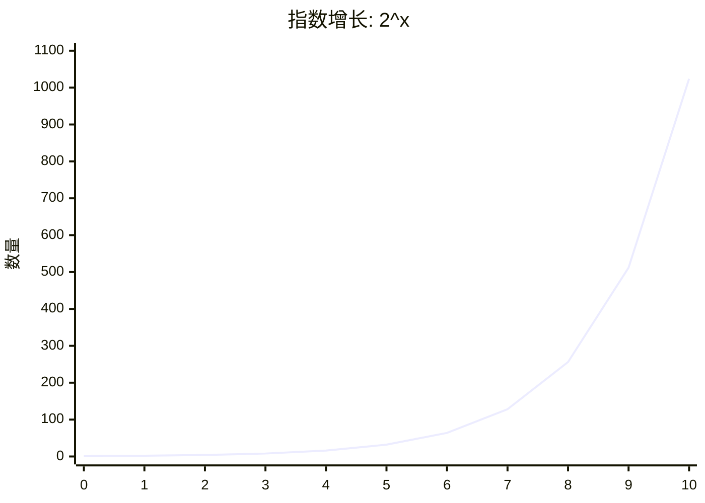
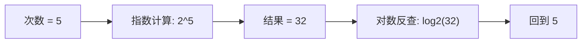
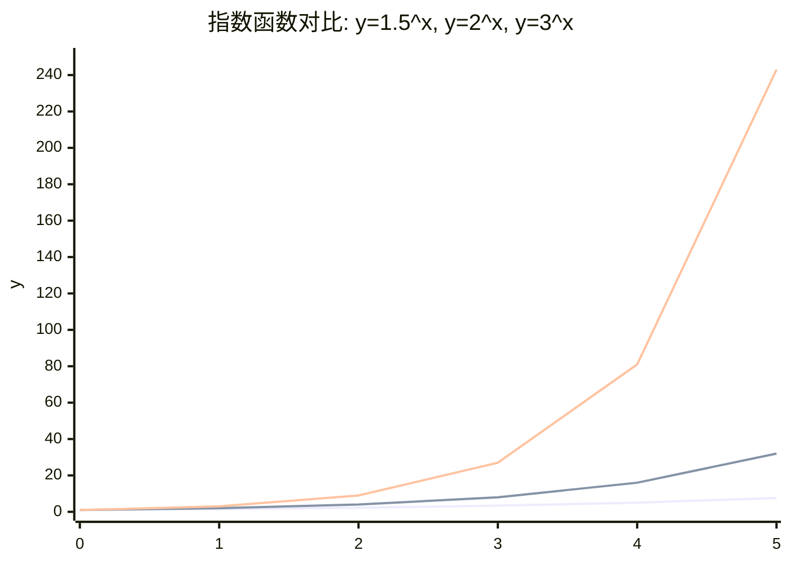
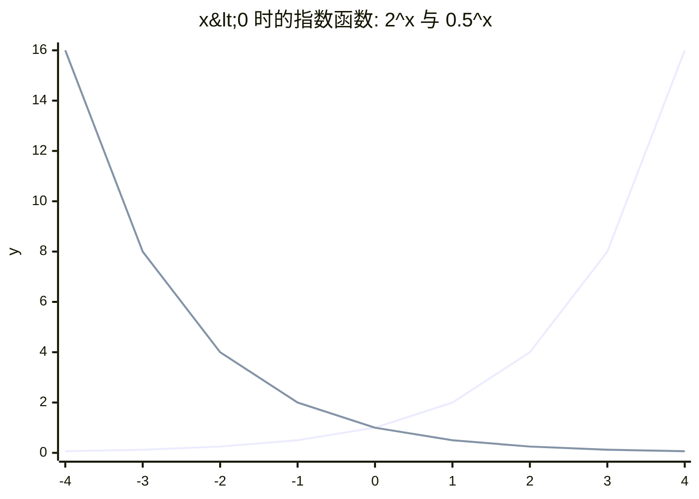
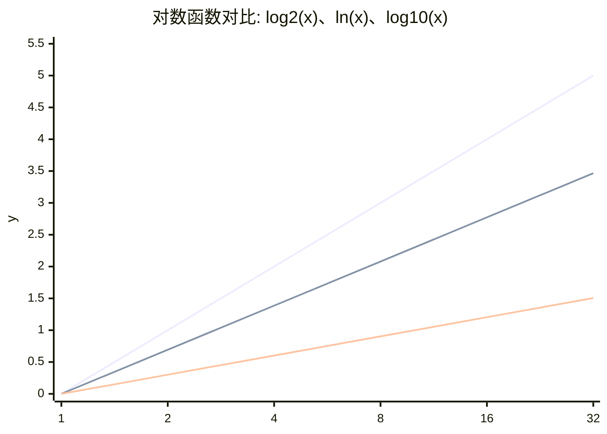
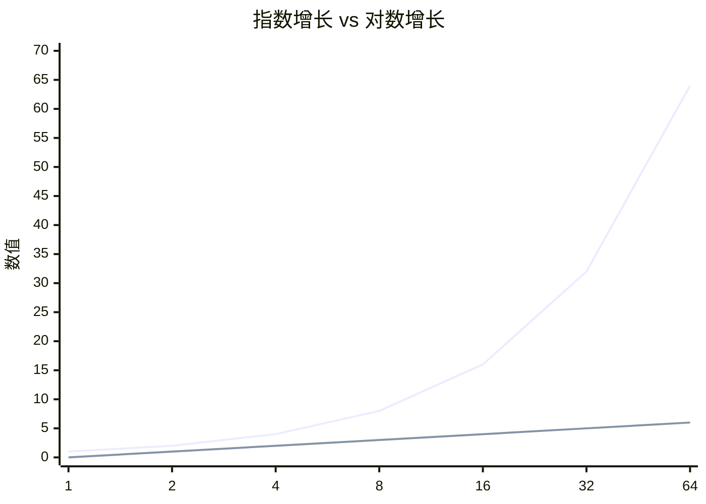

# 指数函数与对数函数：历史、直觉与应用

## 1. 为什么要先讲指数

指数最早不是一个纯代数符号，而是从重复乘法与几何直觉慢慢发展出来的。

在古代数学里，人们先熟悉的是：

* 平方，对应面积
* 立方，对应体积

也就是说，最初的幂概念是和几何图形绑在一起的。后来数学家才逐渐把这种“一个数连续乘自己很多次”的现象，统一写成今天的指数形式。

## 2. 指数的历史起源

### 阿基米德的早期思想

古希腊数学家阿基米德在《数沙者》中研究过极大数量的表示问题。他已经使用了十的幂表示思想（powers of ten），并触及了后来的指数法则核心：

$$
10^a \cdot 10^b = 10^{a+b}
$$

这说明人们很早就意识到：

**同底数相乘时，幂次会相加。**

### 现代记号的形成

到了中世纪和文艺复兴时期，数学从文字叙述逐步走向符号表达。

* 1544 年，Michael Stifel 使用了“指数”（exponent）这一术语
* 1637 年，René Descartes 在《几何学》中推广了接近现代的记号，如 $x^2$、$x^3$

笛卡尔的重要性在于，他把平方、立方、四次方这些原本分散的写法纳入了统一的符号系统。

所以指数的历史，可以概括为三步：

1. 先有平方、立方这类几何概念
2. 再发现幂运算有统一规律
3. 最后形成现代指数记号

## 3. 怎样直觉理解指数

最容易理解指数的例子，就是倍增。

假设一个培养皿里有 1 个细菌，每过 1 小时分裂一次：

* 第 0 小时：$1$
* 第 1 小时：$2 = 2^1$
* 第 2 小时：$4 = 2^2$
* 第 5 小时：$32 = 2^5$
* 第 10 小时：$1024 = 2^{10}$

这里最关键的点是：

**它不是每次加一点，而是每次乘一个倍数。**

这就是指数增长的本质。



从图上看，前面增长似乎不算夸张，但往后会迅速变陡。这就是为什么指数函数常用来描述复利、细胞分裂、传播过程等现象。

---

## 4. 对数为什么会被发明出来

对数在历史上首先是一种计算方法，而不是先作为抽象理论出现的。

17 世纪初，天文学、航海与测量学需要大量高精度乘除运算。由于当时没有电子计算工具，手工计算速度慢且误差率高。

苏格兰数学家纳皮尔（John Napier）在 1614 年发表对数著作，核心目标非常明确：

> 把复杂乘除运算转化为较易执行的加减运算。

这正是对数被发明的直接动因。

其历史上的典型使用流程是“查对数表 -> 加减 -> 查反对数表”。例如计算：

$$
2000 \times 30000
$$

先查常用对数表：

$$
\log_{10}(2000) \approx 3.3010, \quad \log_{10}(30000) \approx 4.4771
$$

利用对数性质把乘法转为加法：

$$
\log_{10}(2000 \times 30000) = 3.3010 + 4.4771 = 7.7781
$$

再查反对数表（antilogarithm），得到：

$$
2000 \times 30000 \approx 10^{7.7781} \approx 6.0 \times 10^7
$$

这套流程体现的正是对数工具的本质价值：

* 把乘法转为加法
* 把除法转为减法
* 把幂运算转为乘法

### Briggs 的推进

纳皮尔的工作发表后，布里格斯（Henry Briggs）推动了以 10 为底的常用对数。后来，对数表成为科学家、工程师和航海人员的标准工具，持续使用了几个世纪。

后来滑尺之所以能做乘除，本质上也是因为它使用了对数刻度。

所以对数的起源可以一句话概括：

**先有计算压力，后有对数工具。**

## 5. 怎样直觉理解对数

如果说指数是在问：

> 做了这么多次倍增，最后会变成多少？

那么对数就在问：

> 已经变成这么大了，那前面到底做了多少次倍增？

还是用细菌的例子。

如果现在有 1024 个细菌，那么它经历了多少次倍增？

$$
\log_2(1024) = 10
$$

因为：

$$
2^{10} = 1024
$$

所以对数的本质不是描述增长本身，而是在反查“达到这个结果，一共经过了多少层”。

例如：

* $\log_2 2 = 1$
* $\log_2 4 = 2$
* $\log_2 8 = 3$
* $\log_2 16 = 4$
* $\log_2 1024 = 10$

原数从 2 增长到 1024，跨度非常大；但对数值只从 1 变到 10。

这说明对数特别适合：

* 压缩跨度很大的数据
* 描述层级、等级与倍数关系

### 常见对数表

下面这张表可以帮助快速建立对不同底数对数的直觉。

| 真数 $x$ | $\log_{10} x$ | $\ln x$ | $\log_2 x$ |
| --- | --- | --- | --- |
| $1$ | $0$ | $0$ | $0$ |
| $2$ | $0.301$ | $0.693$ | $1$ |
| $e \approx 2.718$ | $0.434$ | $1$ | $1.443$ |
| $4$ | $0.602$ | $1.386$ | $2$ |
| $8$ | $0.903$ | $2.079$ | $3$ |
| $10$ | $1$ | $2.303$ | $3.322$ |
| $16$ | $1.204$ | $2.773$ | $4$ |
| $32$ | $1.505$ | $3.466$ | $5$ |
| $100$ | $2$ | $4.605$ | $6.644$ |
| $1024$ | $3.010$ | $6.931$ | $10$ |

读这张表时，可以重点记住三件事：

* $\log_{10} 10 = 1$，所以常用对数很适合十进位尺度
* $\ln e = 1$，所以自然对数和常数 $e$ 天然绑定
* $\log_2 1024 = 10$，所以二进对数很适合描述倍增层数

---

## 6. 指数与对数的关系

现代数学里，两者的关系通常写成：

$$
y = \log_b x \iff b^y = x
$$

例如：

$$
\log_2 32 = 5 \iff 2^5 = 32
$$

它可以直接理解为：

* 指数是从次数推出结果
* 对数是从结果反查次数

最核心的两个恒等式是：

$$
\log_a(a^x) = x
$$

$$
a^{\log_a x} = x
$$

18 世纪，欧拉（Euler）把指数函数、自然对数与常数 $e$ 的关系系统化之后，现代教科书里的这套框架才真正成熟。



这张图表达的就是：指数把次数变成结果，对数把结果还原成次数。

---

## 7. 为什么对数曾经像魔法一样有用

对数在历史上最震撼人的地方，不只是它的定义，而是它能大幅简化运算。

最经典的三个性质是：

$$
\log(ab) = \log a + \log b
$$

$$
\log\left(\frac{a}{b}\right) = \log a - \log b
$$

$$
\log(a^n) = n \log a
$$

它们意味着：

* 乘法可以转成加法
* 除法可以转成减法
* 乘方可以转成乘法

在没有电子计算器的年代，这几乎就是计算效率的革命。

## 8. 图像直觉：一个负责放大，一个负责压缩

### 8.1 指数函数（不同底数）

同样是指数函数 $y=a^x$，底数 $a$ 不同，增长速度会明显不同。



从这张图可以看到：

* 底数越大，增长越快
* $3^x$ 比 $2^x$ 更陡
* $1.5^x$ 增长较慢

当 $x<0$ 时，指数函数同样有清晰规律。由

$$
a^{-n} = \frac{1}{a^n}
$$

可知：

* 若 $a>1$（例如 $2^x$），当 $x<0$ 时函数值在 $(0,1)$ 之间，并且越往左越接近 $0$
* 若 $0<a<1$（例如 $0.5^x$），当 $x<0$ 时函数值会变大



这也解释了为什么指数函数的图像始终在 $x$ 轴上方：无论 $x$ 正负，$a^x$ 都大于 $0$。

当底数在 $0$ 到 $1$ 之间时，指数函数会衰减：

```mermaid
xychart-beta
    title "指数衰减: y=0.5^x"
    x-axis [0, 1, 2, 3, 4, 5, 6]
    y-axis "y" 0 --> 1
    line "0.5^x" [1, 0.5, 0.25, 0.125, 0.0625, 0.0313, 0.0156]
```

### 8.2 对数函数（不同底数）

对数函数 $y=\log_a x$ 也会随底数变化而改变曲线“陡峭程度”。



从这张图可以看到：

* 在 $x>1$ 时，底数越小（且大于 1），曲线越陡
* 所以同样的 $x$，通常有 $\log_2(x) > \ln(x) > \log_{10}(x)$
* 对数函数整体增长都比较慢，体现“压缩尺度”的特性

### 8.3 放大与压缩的一眼对比

下面这张图保留“指数放大 vs 对数压缩”的整体直觉对比。



所以在功能上：

* 指数适合描述倍数增长
* 对数适合压缩大范围尺度

---

## 9. 为什么它们在机器学习里仍然无处不在

指数和对数并没有停留在历史里，它们今天仍然是机器学习和深度学习的核心工具。

### 软最大函数（Softmax）为什么要用指数

软最大函数会把未归一化得分（logits）转换为概率分布。指数函数在这里的作用，是放大不同分数之间的差异，让模型更容易突出较大的分值。

### 为什么损失函数里常出现对数

在概率模型里，很多概率需要连乘。如果直接连乘，很容易得到非常小的数值。取对数后：

* 连乘会变成连加
* 数值会更稳定
* 更方便求导和优化

这就是对数似然（log-likelihood）与交叉熵（cross-entropy）经常使用对数的原因。

### 为什么资料常做对数变换

很多真实数据都有很大的跨度，例如：

* 词频
* 收入
* 房价
* 观看量

这时进行对数变换（log transform），能把极端大的值压缩下来，让模型更容易学习整体规律。

---

## 10. 总结

整条逻辑线其实很清楚：

1. 指数最早来自平方、立方与重复乘法
2. 数学家逐步总结出统一的幂法则和现代记号
3. 对数在 17 世纪因为计算压力而被发明出来
4. Euler 等人后来把指数、对数和自然底数 $e$ 的关系系统化
5. 到今天，它们成为机器学习里处理增长、概率和数值稳定性的基础工具

最值得记住的一句话是：

**指数负责生成和放大，对数负责反查和压缩。**

---

## 第二部分：指数与对数的数学性质及应用

## 1. 数学定义与互逆关系

设底数满足 $a>0$ 且 $a \neq 1$。

* 指数函数定义为：$f(x)=a^x$
* 对数函数定义为：$g(x)=\log_a x$

二者互为反函数：

$$
y=a^x \iff x=\log_a y
$$

这意味着它们关于直线 $y=x$ 对称。

## 2. 定义域、值域与单调性

### 指数函数 $y=a^x$

* 定义域：$\mathbb{R}$
* 值域：$(0,+\infty)$
* 当 $a>1$ 时，严格递增
* 当 $0<a<1$ 时，严格递减

### 对数函数 $y=\log_a x$

* 定义域：$(0,+\infty)$
* 值域：$\mathbb{R}$
* 当 $a>1$ 时，严格递增
* 当 $0<a<1$ 时，严格递减

## 3. 核心运算性质

### 指数运算律

$$
a^m \cdot a^n = a^{m+n},\quad \frac{a^m}{a^n}=a^{m-n},\quad (a^m)^n=a^{mn}
$$

### 对数运算律

$$
\log_a(MN)=\log_a M+\log_a N
$$

$$
\log_a\left(\frac{M}{N}\right)=\log_a M-\log_a N
$$

$$
\log_a(M^k)=k\log_a M
$$

### 换底公式

$$
\log_a b = \frac{\ln b}{\ln a}
$$

该公式常用于将任意底数对数转换成自然对数，便于分析与计算。

## 4. 微积分性质

### 导数

$$
\frac{d}{dx}a^x = a^x \ln a
$$

$$
\frac{d}{dx}\ln x = \frac{1}{x},\quad \frac{d}{dx}\log_a x = \frac{1}{x\ln a}
$$

### 积分

$$
\int a^x\,dx = \frac{a^x}{\ln a}+C
$$

$$
\int \frac{1}{x}\,dx = \ln|x|+C
$$

### 曲率与凸性

先给出标准定义。设函数 $f$ 定义在凸集 $D$ 上：

* 若对任意 $x,y\in D$ 与任意 $\lambda\in[0,1]$，都有

$$
f(\lambda x+(1-\lambda)y)\le \lambda f(x)+(1-\lambda)f(y),
$$

则称 $f$ 在 $D$ 上为凸函数。

* 若对任意 $x,y\in D$ 与任意 $\lambda\in[0,1]$，都有

$$
f(\lambda x+(1-\lambda)y)\ge \lambda f(x)+(1-\lambda)f(y),
$$

则称 $f$ 在 $D$ 上为凹函数。

几何上可理解为：凸函数图像“向上弯”，凹函数图像“向下弯”；等价地，任意两点连线分别位于图像上方或下方。

* 当 $a>1$ 时，$a^x$ 为凸函数
* $\ln x$ 在 $(0,+\infty)$ 上为凹函数

这两个结论在优化理论中非常关键，因为它们直接影响目标函数形状与最优化难度。

## 5. 数学中的典型使用案例

### 案例 1：复利增长模型

若年利率为 $r$，按连续复利计息，初始本金 $P_0$ 在时间 $t$ 后变为：

$$
P(t)=P_0 e^{rt}
$$

这是一类标准指数增长模型。

### 案例 2：指数衰减模型

放射性衰变、药物代谢等常写为：

$$
N(t)=N_0 e^{-\lambda t}
$$

其中 $\lambda>0$ 为衰减常数。

### 案例 3：由指数方程反求时间

若已知 $N(t)=N_0 e^{kt}$，求达到阈值 $N^*$ 的时间：

$$
t=\frac{1}{k}\ln\frac{N^*}{N_0}
$$

这体现了“指数负责生成、对数负责反求”的数学意义。

## 6. 机器学习中的常见使用

### 6.1 软最大函数（Softmax）

给定向量 $z\in\mathbb{R}^K$，第 $i$ 类概率为：

$$
\mathrm{Softmax}(z_i)=\frac{e^{z_i}}{\sum_{j=1}^{K}e^{z_j}}
$$

指数项用于放大类别分数差异，再通过归一化得到概率分布。

### 6.2 交叉熵与对数似然

二分类交叉熵常写为：

$$
\mathcal{L}=-\big[y\ln p + (1-y)\ln(1-p)\big]
$$

使用对数有三点好处：

* 将概率连乘转为求和，计算更稳定
* 减少极小概率导致的数值下溢风险
* 导数形式更简洁，便于梯度优化

### 6.3 对数几率与逻辑回归

逻辑回归把概率映射为对数几率：

$$
\log\frac{p}{1-p}=w^Tx+b
$$

这使得原本非线性的概率关系转化为线性可分的参数表达。

### 6.4 对数变换特征工程

对于长尾分布特征（如点击量、收入、词频），常用：

$$
x' = \ln(1+x)
$$

其作用是压缩动态范围、降低偏态、提升模型训练稳定性。

### 6.5 Log-Sum-Exp 稳定技巧

直接计算 $\ln\sum_i e^{x_i}$ 容易溢出，常用变形：

$$
\ln\sum_i e^{x_i} = m + \ln\sum_i e^{x_i-m},\quad m=\max_i x_i
$$

这是数值计算与深度学习实现中的标准稳定化技巧。

## 7. 第二部分小结

从数学角度看，指数与对数是一组互逆函数，并在代数、微积分、建模与优化中形成完整闭环；从机器学习角度看，它们既是概率建模的核心表达工具，也是数值稳定与训练效率的重要保障。
